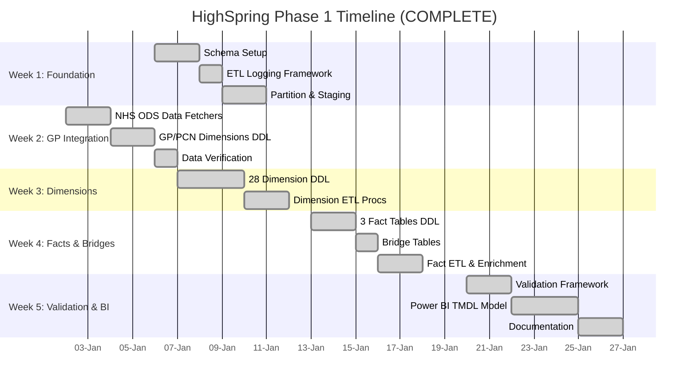
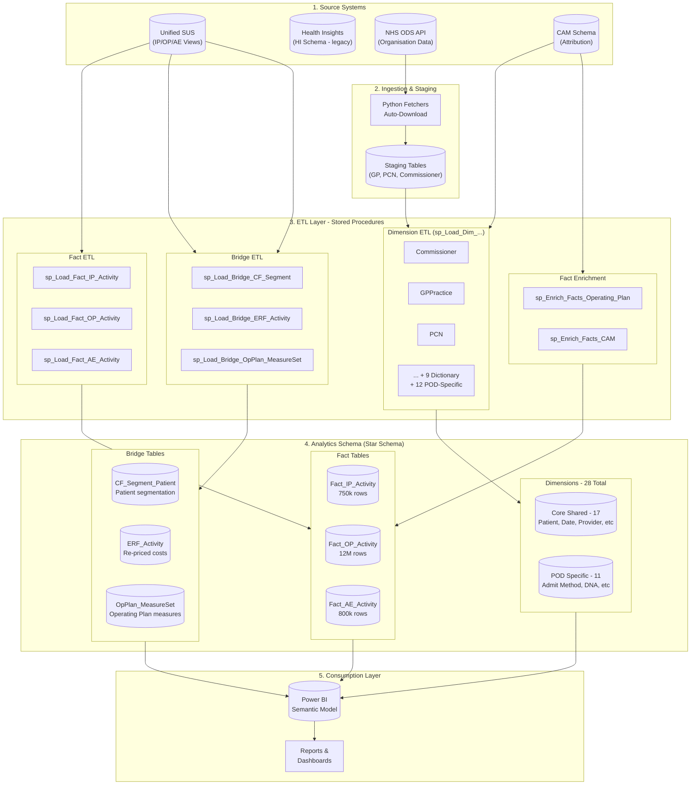

# Project Plan: HighSpring Datamodel (Phase 1)

**Target Delivery:** January 31, 2026
**Last Updated:** 2026-01-29
**Database:** `[Data_Lab_SWL_Live].[Analytics]`

> **Status (2026-01-29):** Phase 1 implementation complete. All SQL objects deployed, Power BI TMDL model finalized. Ready for data load execution and validation.

Quick links (current-state documentation):

- Project instructions: [../CLAUDE.md](../CLAUDE.md) - Primary reference for Claude Code sessions
- Validation guide: [FACT_VALIDATION_USER_GUIDE.md](FACT_VALIDATION_USER_GUIDE.md)
- Power BI build guide: [../powerbi/PBIX_BUILD_GUIDE.md](../powerbi/PBIX_BUILD_GUIDE.md)
- Schema overview: [SCHEMA_OVERVIEW.md](SCHEMA_OVERVIEW.md)


---

## Table of Contents

1. [Executive Summary](#executive-summary)
2. [Progress Dashboard](#progress-dashboard)
3. [Operational Snapshot (Current State)](#operational-snapshot-current-state)
4. [Timeline & Dependencies](#timeline--dependencies)
5. [Design Principles](#design-principles)
6. [End-to-End Solution Architecture](#end-to-end-solution-architecture)
7. [Architecture Rationale: Key Design Choices](#architecture-rationale-key-design-choices)
8. [Cloud Data Warehouse Migration Strategy](#cloud-data-warehouse-migration-strategy)
9. [Data Scope & Constraints](#data-scope--constraints)
10. [Week-by-Week Roadmap](#week-by-week-roadmap)
   - [Week 4: Facts & Patient Bridge](#week-4-facts--patient-bridge-complete)
     - [1. Fact_IP_Activity](#1-fact_ip_activity-inpatient-admissions)
     - [2. Fact_OP_Activity](#2-fact_op_activity-outpatient-appointments)
     - [3. Fact_AE_Activity](#3-fact_ae_activity-ae-attendances)
     - [4. Bridge_ERF_Activity](#4-bridge_erf_activity-elective-recovery-fund-re-pricing)
     - [5. Bridge_Operating_Plan_Activity](#5-bridge_operating_plan_activity-nhs-planning-metrics)
     - [6. Bridge_Patient_Segment](#6-bridge_patient_segment-patient-intelligence)
11. [Dimension-Fact Usage Matrix](#dimension-fact-usage-matrix)
12. [Risk Register](#risk-register)
13. [Key References](#key-references)
14. [Success Metrics](#success-metrics)
15. [Change Log](#change-log)

---

## <span style="color: #7030A0;">Executive Summary</span>

**HighSpring Phase 1 is complete.** We have delivered a robust, scalable Star Schema analytics platform for SWL ICB, enabling Patient Intelligence reporting (Core20PLUS5, Multi-morbidity, Frailty) and NHS operational analytics.

**What was delivered:**
1. **28 Dimensions** (5 tables + 23 views) covering organizational, clinical, and reference data
2. **3 Fact Tables** (IP, OP, AE) with 20+ FK relationships each
3. **Power BI TMDL Model** with 31 tables and 40+ relationships
4. **Comprehensive ETL Framework** with 30+ stored procedures
5. **Data Validation Framework** with 7 automated quality checks

**Core Strategy (executed):**
1.  **Simplify:** Static Bridge Tables for Phase 1, bypassing complex temporal tracking
2.  **Focus:** Foundation (28 dimensions) before transaction layers (fact tables)
3.  **Deliver:** "Big 3" Fact tables (IP, OP, AE) covering 90% of analytic needs

**Key Achievement:** Reduced scope from 88 dimensions (V2 baseline) to 28 essential dimensions, delivered in 5 weeks vs 8-10 week alternative.

---

## <span style="color: #7030A0;">Progress Dashboard</span>

| Week | Phase | Status | Completion | Key Deliverables |
|------|-------|--------|------------|------------------|
| **Week 1** | Foundation | Complete | 100% | Schema, ETL Logging, Partition Framework, Staging |
| **Week 2** | GP Integration | Complete | 100% | NHS ODS Fetchers, GP/PCN/Commissioner Dimensions |
| **Week 3** | Dimensions | Complete | 100% | 28 Dimensions (5 tables + 23 views + date events) |
| **Week 4** | Facts & Bridges | Complete | 100% | 3 Facts, 3 Denormalized Views, 5 Bridge Tables, 30+ ETL Procs |
| **Week 5** | Validation & BI | Complete | 100% | Validation Framework, Power BI TMDL Model (31 tables) |

**Current Status:** Phase 1 implementation complete - all code deployed
**Next Action:** Execute data loads via ETL orchestration script

**Execution Order:**
1. Load dimensions: `sql/04_etl/00_Run_All_Dimension_Loads.sql`
2. Load facts + enrichments: `EXEC [Analytics].[sp_Run_Fact_Loads_With_Enrichment]`
3. Run validation: `EXEC [Analytics].[sp_Validate_Fact_Data]`

---

## <span style="color: #7030A0;">Operational Snapshot (Current State)</span>

This snapshot reflects the current code base as of 2026-01-29.

### Repository Structure

```
highspring/
├── sql/                             # Core SQL deployment scripts
│   ├── 00_setup/                    # Schema, partitioning, staging (19 files)
│   ├── 01_dimensions/               # 28 dimension tables/views (36 files)
│   ├── 02_facts/                    # 3 fact tables + 3 views (6 files)
│   ├── 04_etl/                      # ETL stored procedures (30 files)
│   └── 06_validation/               # Data validation framework (1 file)
├── powerbi/
│   ├── tmdl/                        # Power BI TMDL model (31 table files)
│   │   ├── model.tmdl
│   │   ├── relationships.tmdl
│   │   └── tables/*.tmdl
│   └── PBIX_BUILD_GUIDE.md
├── docs/                            # Documentation
├── scripts/                         # Deployment utilities
├── CLAUDE.md                        # Project instructions
└── README.md
```

### What is deployed (current inventory)

**Dimension Objects (28):**
- 5 Tables: `tbl_Dim_Patient`, `tbl_Dim_POD`, `tbl_Dim_CAM_Service_Category`, `tbl_Dim_CAM_Assignment_Reason`, `tbl_Dim_OpPlan_MeasureSet`
- 23 Views: `vw_Dim_Commissioner`, `vw_Dim_Provider`, `vw_Dim_GPPractice`, `vw_Dim_PCN`, `vw_Dim_LSOA`, `vw_Dim_Specialty`, `vw_Dim_HRG`, `vw_Dim_Gender`, `vw_Dim_Ethnicity`, `vw_Dim_Age_Band`, `vw_Dim_Admission_Method`, `vw_Dim_Admission_Source`, `vw_Dim_Discharge_Method`, `vw_Dim_Discharge_Destination`, `vw_Dim_IP_Patient_Classification`, `vw_Dim_Attendance_Status`, `vw_Dim_Attendance_Outcome`, `vw_Dim_Attendance_Type`, `vw_Dim_DNA_Indicator`, `vw_Dim_Priority_Type`, `vw_Dim_Referral_Source`, `vw_Dim_Attendance_Disposal`, `vw_Dim_Date`
- Supporting: `tbl_Dim_Date_Events`, `vw_Dim_Measures_Catalogue`, `vw_Dim_OpPlan_Measure`

**Fact Objects (6):**
- Tables: `tbl_Fact_IP_Activity`, `tbl_Fact_OP_Activity`, `tbl_Fact_AE_Activity`
- Denormalized Views: `vw_Fact_IP_Activity_Denormalised`, `vw_Fact_OP_Activity_Denormalised`, `vw_OpPlan_ActualActivity_Analytics`

**Bridge/Reference Tables:**
- `tbl_Bridge_ERF_Activity` - Elective Recovery Fund activity
- `tbl_Bridge_OpPlan_MeasureSet` - Operating Plan measure mappings
- `tbl_Bridge_CF_Segment_Patient_Snapshot` - CF segmentation

**ETL Stored Procedures (20+):**
- Dimension loaders: `sp_Load_Dim_Commissioner`, `sp_Load_Dim_GPPractice`, `sp_Load_Dim_PCN`, `sp_Load_Dim_LSOA`, `sp_Load_Dim_CAM_*`, `sp_Load_Dim_Patient`
- Fact loaders: `sp_Load_Fact_IP_Activity`, `sp_Load_Fact_OP_Activity`, `sp_Load_Fact_AE_Activity`
- Enrichment: `sp_Enrich_Facts_CAM`, `sp_Enrich_Facts_Operating_Plan`, `sp_Enrich_Facts_ERF`
- Orchestration: `sp_Run_Fact_Loads_With_Enrichment`
- Validation: `sp_Validate_Fact_Data`

**Power BI TMDL Model:**
- 31 table definitions with full dimensional attributes
- 40+ relationships (including role-playing date relationships)
- Located at: `powerbi/tmdl/`

### Current execution order

1. **Load dimensions:**
   ```sql
   -- Run in SSMS or sqlcmd
   :r sql/04_etl/00_Run_All_Dimension_Loads.sql
   ```

2. **Load facts + enrichments:**
   ```sql
   EXEC [Analytics].[sp_Run_Fact_Loads_With_Enrichment]
       @FinYearStart = '2025',
       @FinancialYear = '2025/2026',
       @FromDate = NULL,
       @ToDate = NULL;
   ```

3. **Load optional bridges:**
   ```sql
   EXEC [Analytics].[sp_Load_Bridge_ERF_Activity] @FinYearStart = '2025';
   EXEC [Analytics].[sp_Load_Bridge_CF_Segment_Patient_Snapshot] @SnapshotMonth = 202512;
   ```

4. **Run validation:**
   ```sql
   EXEC [Analytics].[sp_Validate_Fact_Data]
       @FromDate = '2025-04-01',
       @ToDate = '2025-12-31',
       @MaterialityThreshold = 100;
   ```

### Upstream dependencies (external to this repo)

- Unified SUS materialised views for IP/OP/AE.
- ERF re-priced activity views (`Analytics.vw_IP_ERF`, `Analytics.vw_OP_ERF`) feed `Analytics.tbl_ERF_Repriced_Active`.
- Operating Plan inputs:
  - `PLNG.Get_OpPlan_ActivityBridge_*_UfS` TVFs (source)
  - `Analytics.tbl_OpPlan_Active` (precomputed)
- CAM enrichment:
  - `CAM.fn_CommissionerAssignment`
  - `CAM.vw_SUS_CAM`

### Phase 1 Deliverables Complete

**All development work is complete.** Remaining operational tasks:

- [ ] Execute first controlled data load (dimensions → facts → enrichments → bridges)
- [ ] Populate CF rules in `[Analytics].[tbl_Ref_CF_Segment_Rule_ICD10]` for segmentation
- [ ] Run validation checks and review results
- [ ] Build PBIX from TMDL model (see [../powerbi/PBIX_BUILD_GUIDE.md](../powerbi/PBIX_BUILD_GUIDE.md))
- [ ] Stakeholder sign-off on Phase 1

---

## <span style="color: #7030A0;">Timeline & Dependencies</span>

**Phase 1 completed on schedule: 2026-01-29**



**Milestone Summary:**
| Milestone | Planned | Actual | Status |
|-----------|---------|--------|--------|
| Foundation Complete | 2026-01-10 | 2026-01-10 | ✅ |
| Dimensions Complete | 2026-01-17 | 2026-01-17 | ✅ |
| Facts & ETL Complete | 2026-01-24 | 2026-01-24 | ✅ |
| Semantic Model Complete | 2026-01-29 | 2026-01-29 | ✅ |
| Phase 1 Sign-Off | 2026-01-31 | Pending | ⏳ |

---

## <span style="color: #7030A0;">Design Principles</span>

These principles guided Phase 1 delivery:

1.  **Pragmatic over Perfect** - Phase 1 delivers 80% of value with 40% of effort. Advanced features deferred to Phase 2.
2.  **Reuse over Rebuild** - Use existing Dictionary schema dimensions where possible.
3.  **Simple over Complex** - Static Bridge Table instead of temporal tracking (4-5 weeks vs 8-10 weeks).
4.  **Proven over Novel** - Standard Star Schema patterns, no experimental designs.
5.  **Documented over Tribal** - Every major decision captured in writing.

---

## <span style="color: #7030A0;">End-to-End Solution Architecture</span>

The platform integrates data from multiple NHS and local sources, transforming it through a staged pipeline into a unified analytics layer. **All data flows through stored procedures (ETL layer)** - there are no direct inserts into the Analytics schema.



**Key Architecture Notes:**

1. **No Direct Inserts:** All analytics tables are populated exclusively via stored procedures. This ensures:
   - Consistent SCD Type 2 logic for dimensions
   - Proper partition management for facts
   - Audit logging for all data loads
   - Rollback capability on failures

2. **ETL Orchestration:** Deployment creates objects; dimensions are loaded via `04_etl/00_Run_All_Dimension_Loads.sql`, and facts + enrichments are tied together via `sp_Run_Fact_Loads_With_Enrichment` to avoid missed steps:
   - Dimensions first (they have no dependencies)
   - Facts next (depend on dimensions for foreign keys)
   - Enrichments (Operating Plan + CAM) run immediately after facts in the same wrapper
   - Bridges (ERF, segmentation) run afterward as needed

3. **Segmentation ETL (current implementation):** CF segmentation is derived from Unified SUS diagnosis codes using a rule table (no HI dependency).

   - Rule tables: `[Analytics].[tbl_Ref_CF_Segment]`, `[Analytics].[tbl_Ref_CF_Segment_Rule_ICD10]`
   - Load proc: `sp_Load_Bridge_CF_Segment_Patient_Snapshot`
   - Details: [bridge_patient_segment_strategy.md](bridge_patient_segment_strategy.md) and [analytics_platform_reference_index.md](analytics_platform_reference_index.md)

4. **Smart Refresh Pattern:** Before loading facts, we validate source data integrity to catch ISL data drop issues:
   ```sql
   -- sp_Validate_Pre_Refresh: Runs BEFORE fact loads + enrichment (sp_Run_Fact_Loads_With_Enrichment)
   
   1. Row Count Variance Check
      - Compare: current Unified views vs last successful load
      - Threshold: >15% drop = BLOCK refresh
      - Example: If last IP load = 125k rows, current = 95k rows → 24% drop → BLOCK
   
   2. Partition Completeness Check
      - Verify all expected monthly partitions present (rolling 6 months)
      - Missing partition (e.g., April data absent) = BLOCK refresh
   
   3. Critical Metrics Stability Check
      - Total activity cost variance <20% month-over-month
      - Mean/median admissions per trust variance <25%
      - Sudden anomaly (e.g., 50% cost drop) = BLOCK refresh
   
   4. Deferral & Notification Workflow
      - Log issue to ETL_Logging with severity = CRITICAL
      - Email build team: "Refresh deferred - data integrity issue detected"
      - Set refresh status = DEFERRED in control table
      - Require manual investigation and override flag to proceed
   ```
   
   **Rationale:** ISL occasionally drops historical data due to internal processing issues. Smart refresh prevents loading incomplete datasets that would corrupt our 6-month rolling window. The build team investigates, liaises with ISL if needed, and manually approves refresh once source data is corrected.

---

## <span style="color: #7030A0;">Architecture Rationale: Key Design Choices</span>

This section documents the **trade-offs** we've made and **future decisions** we still need to finalise. Completed decisions are in [DESIGN_DECISIONS.md](DESIGN_DECISIONS.md).

### Rationale 1: Static Bridge vs Temporal Tracking (DEFERRED TO PHASE 2)

**Rationale:**
- Temporal tracking requires 8-10 weeks, senior analyst skills, complex SCD Type 2 logic
- Static snapshot delivers 4-5 weeks, junior analyst capable, simple truncate/reload
- Phase 1 answers 80% of business questions without temporal history
- Can add temporal tracking in Phase 2 based on actual user demand

**Alternatives Considered:**
- Full temporal tracking with monthly snapshots (rejected - too complex for Phase 1)
- No patient segmentation at all (rejected - core requirement for Core20PLUS5 reporting)

**Reference:** [docs/ideas/phase1_pragmatic_plan.md](ideas/phase1_pragmatic_plan.md)

### Rationale 2: 28 Essential Dimensions (Completed 2026-01-29)

**Decision Made:** Reduce from 88 dimensions (V2 baseline) to 28 essential dimensions for Phase 1.

**Rationale:**
- Systematic analysis identified 17 dimensions as out-of-scope (care home, local codes, legacy)
- 35 dimensions deferred to Phase 2 (low usage, SWL-specific, advanced features)
- 28 dimensions cover all essential analytic needs across IP, OP, AE
- Reduces build time and complexity without sacrificing core functionality

**Categories:**
- **Tables (5):** Patient, POD, CAM_Service_Category, CAM_Assignment_Reason, OpPlan_MeasureSet
- **Core Views (12):** Commissioner, Provider, GPPractice, PCN, LSOA, Specialty, HRG, Gender, Ethnicity, Age_Band, Date, Measures_Catalogue
- **IP-Specific Views (5):** Admission_Method, Admission_Source, Discharge_Method, Discharge_Destination, IP_Patient_Classification
- **OP-Specific Views (7):** Attendance_Status, Attendance_Outcome, Attendance_Type, DNA_Indicator, Priority_Type, Referral_Source, Attendance_Disposal

**Reference:** [docs/ideas/dimension_model.md](ideas/dimension_model.md)

### Rationale 3: Denormalised PCN Hierarchy (Completed 2026-01-02)

**Decision Made:** Include PCN attributes directly in `Dim_GPPractice` rather than creating a separate `Dim_PCN` table.

**Rationale:**
- PCNs have 1:Many relationship with GP Practices (one PCN, many practices)
- Denormalization simplifies queries (no extra join needed)
- PCN attributes rarely change independently of practice changes
- Aligns with Kimball best practices for low-cardinality hierarchies

**Reference:** [DESIGN_DECISIONS.md](DESIGN_DECISIONS.md)

## <span style="color: #7030A0;">Cloud Data Warehouse Migration Strategy</span>

### SQL dialect rule (refreshed)

**Phase 1 implementation is SQL Server-first.** The repo contains T-SQL (including square brackets, SQLCMD includes, and SQL Server stored procedures).

**Migration note:** Snowflake/Fabric migration is a Phase 2+ activity. Do not block Phase 1 delivery on ANSI portability; instead, preserve *design intent* and document any T-SQL-specific assumptions.

---

### Snowflake Migration Readiness

**Target Timeline:** 2-3 months (potential)

**Migration Path:**
1. **Schema Migration** (Week 1)
   - Convert DDL to Snowflake syntax (remove SQL Server-specific types)
   - Replace `IDENTITY` with Snowflake `AUTOINCREMENT`
   - Convert stored procedures to Snowflake JavaScript UDFs
   - Estimated effort: 3-5 days

2. **Data Migration** (Week 2-3)
   - Use Snowflake COPY command from Azure Blob Storage
   - Bulk load historical data (6-month rolling window)
   - Verify row counts and data quality
   - Estimated effort: 1-2 weeks

3. **ETL Migration** (Week 4)
   - Convert T-SQL ETL to Snowflake tasks + streams
   - Replace SQL Server Agent jobs with Snowflake task scheduling
   - Implement Snowflake-native CDC (Change Data Capture)
   - Estimated effort: 1 week

**Migration Complexity:** Moderate (6-8 weeks)

---

### Microsoft Fabric Migration Readiness

**Target Timeline:** 2-3 months (alternative to Snowflake)

**Migration Path:**
1. **Lakehouse Setup** (Week 1)
   - Create Fabric Lakehouse in OneLake
   - Define Delta Lake tables (Star Schema)
   - Configure shortcuts to Unified SUS source
   - Estimated effort: 2-3 days

2. **Data Pipeline Migration** (Week 2-3)
   - Convert SQL Server ETL to Fabric Data Pipelines
   - Use Dataflow Gen2 for transformations
   - Implement incremental refresh with Delta Lake
   - Estimated effort: 1-2 weeks

3. **Power BI Integration** (Week 4)
   - Direct Lake mode (zero ETL to Power BI)
   - Real-time semantic model updates
   - OneLake integration for all data products
   - Estimated effort: 1 week

**Migration Complexity:** Moderate (6-8 weeks)

---

**Decision:** Defer platform choice to Month 3 after SQL Server proof-of-concept complete.

## <span style="color: #7030A0;">Data Scope & Constraints</span>

### HI schema limitation (refreshed)

**HI is SWL-only, but Phase 1 does not depend on HI.**

- Implemented CF segmentation in this repo is rule-driven from `legacy_sql/clsp_cf` and Unified SUS diagnosis fields (no `HI.vw_CF_Segmentation` dependency).
- HI views (Core20/LTC/HIU) remain useful context for Phase 2, but are not required for Phase 1 execution.

### Data Window: 6 Months Rolling
All fact tables maintain a 6-month rolling window, refreshed weekly via partition switching.

**Rationale:**
- Balances performance (smaller dataset) with analytic utility (6 months = 2 quarters)
- Aligns with operational reporting cadence
- Historical analysis beyond 6 months available in Unified SUS archive

---

## <span style="color: #7030A0;">Week-by-Week Roadmap</span>

### Week 1: Foundation (COMPLETE)

**Objective:** Establish infrastructure for automated, logged deployments.

**Delivered Artifacts:**
- [sql/00_setup/01_Create_Analytics_Schema.sql](../sql/00_setup/01_Create_Analytics_Schema.sql)
- [sql/00_setup/03_Create_ETL_Logging.sql](../sql/00_setup/03_Create_ETL_Logging.sql)
- [sql/00_Run_Everything_SQLCMD.sql](../sql/00_Run_Everything_SQLCMD.sql) (Master deployment script)
- `scripts/dev/start_db.sh` (Docker helper)
- `docker-compose.yml` (Local SQL Server environment)
- Environment setup: `scripts/setup_env.sh`

**Key Achievement:** Created automated deployment script that deploys entire schema in <5 minutes. This is now the standard SOP.

**Lessons Learned:**
- SQLCMD mode in VS Code requires explicit `:r` commands for file includes
- Docker SQL Server 2017 requires specific compatibility flags for Analytics schema

---

### Week 2: GP Practice Integration (91% COMPLETE)

**Objective:** Build the organisational hierarchy (Commissioners, GP Practices, PCNs) that forms the attribution spine of the analytics.

**Delivered Artifacts:**
- **Python Fetchers:**
  - `scripts/data_integration/nhs_ods/parse_epraccur.py` (GP Practices)
  - `scripts/data_integration/nhs_ods/parse_epcn.py` (PCNs)
  - `scripts/data_integration/nhs_ods/parse_prescribing_roles.py` (Reference data)

- **Staging Tables:**
   - [sql/00_setup/04_Create_Staging_NHS_ODS.sql](../sql/00_setup/04_Create_Staging_NHS_ODS.sql)
  - Staging schema includes: `tbl_Staging_GP_Practice`, `tbl_Staging_PCN`

- **Dimension DDL:**
   - [sql/01_dimensions/01_Create_Dim_Commissioner.sql](../sql/01_dimensions/01_Create_Dim_Commissioner.sql)
   - [sql/01_dimensions/02_Create_Dim_POD.sql](../sql/01_dimensions/02_Create_Dim_POD.sql)
   - [sql/01_dimensions/03_Create_Dim_GPPractice.sql](../sql/01_dimensions/03_Create_Dim_GPPractice.sql)
   - [sql/01_dimensions/04_Create_Dim_PCN.sql](../sql/01_dimensions/04_Create_Dim_PCN.sql)

- **ETL Procedures:**
   - [sql/04_etl/01_Load_Dim_Commissioner.sql](../sql/04_etl/01_Load_Dim_Commissioner.sql)
   - [sql/04_etl/02_Load_Dim_GPPractice.sql](../sql/04_etl/02_Load_Dim_GPPractice.sql)
   - [sql/04_etl/03_Load_Dim_PCN.sql](../sql/04_etl/03_Load_Dim_PCN.sql)


**Outstanding Tasks:**
- [ ] Run `parse_epraccur.py` to generate latest GP data SQL
- [ ] Verify staging table row counts (~15,352 GP practices nationally, 374 SWL)
- [ ] Confirm ICB distribution (should show 43 distinct ICBs, not hardcoded to one)

**Lessons Learned:**
- NHS ODS API returns HTTP 406 if you include `Status` parameter - must be omitted
- Column widths matter: Had to widen `Prescribing_Setting` to VARCHAR(255) after truncation errors
- Added `Operational_End_Date` logic to properly handle legacy CCG "active" statuses

**Reference:** [ods_dimensions_operational_guide.md](ods_dimensions_operational_guide.md)

---

### Week 3: Dimensions Build (COMPLETE)

**Implementation (2026-01-29):**
- 28 dimensions implemented as a mix of tables (5) and dictionary-backed views (23) under `sql/01_dimensions/`
- LSOA loaded from `[Data_Lab_SWL].[ref].[tbl_LSOA_ICB_CA_LocalAuthority]` via `sp_Load_Dim_LSOA`
- Dim_Patient table created with ETL procedure `sp_Load_Dim_Patient`
- All OP dimensions implemented: Attendance_Status, Attendance_Outcome, Attendance_Type, DNA_Indicator, Priority_Type, Referral_Source, Attendance_Disposal
- CAM dimensions: `tbl_Dim_CAM_Service_Category`, `tbl_Dim_CAM_Assignment_Reason`
- OpPlan dimensions: `tbl_Dim_OpPlan_MeasureSet`, `vw_Dim_OpPlan_Measure`

**Delivered Artifacts:**
- 36 SQL files in `sql/01_dimensions/`
- 8 dimension loader procedures in `sql/04_etl/`
- Orchestration script: `sql/04_etl/00_Run_All_Dimension_Loads.sql`

---

### Week 4: Facts & Patient Bridge (COMPLETE)

**Objective:** Implement the transactional core (fact tables) and the Patient Intelligence capability (bridge table).

**Fact Tables Strategy:**
- Monthly partitioning on activity date
- Clustered Columnstore Indexes for compression
- 6-month rolling window via partition switching

**Deliverables:**

## <span style="color: #7030A0;">1. Fact_IP_Activity (Inpatient Admissions)</span>

**Table Grain:** One row per inpatient spell (admission to discharge episode)

**Data Availability:** Ready - Most efficiency measures already calculated in Unified SUS materialised tables.

---

### Fact table structure (current)

For the authoritative column list, use:
- DDL: `sql/02_facts/01_Create_tbl_Fact_IP_Activity.sql`
- ETL: `sql/04_etl/10_sp_Load_Fact_IP_Activity.sql`

**Current notes:**
- Partitioning dates: `Admission_Date`, `Discharge_Date`.
- LSOA captured as `SK_LSOA_ID` plus degenerate `LSOA_Code`.
- Admission/discharge/classification are modelled as dimensions (no code columns stored on the fact).

## <span style="color: #7030A0;">2. Fact_OP_Activity (Outpatient Appointments)</span>

**Table Grain:** One row per outpatient appointment

**Data Availability:** Ready - RTT metrics already calculated in Unified SUS materialised tables.

---

### Fact table structure (current)

For the authoritative column list, use:
- DDL: `sql/02_facts/02_Create_tbl_Fact_OP_Activity.sql`
- ETL: `sql/04_etl/11_sp_Load_Fact_OP_Activity.sql`

**Current notes:**
- Partitioning date: `Appointment_Date`.
- LSOA captured as `SK_LSOA_ID` plus degenerate `LSOA_Code`.
- OP attendance status/DNA indicators are placeholders (`-1`) in the current build.

## <span style="color: #7030A0;">3. Fact_AE_Activity (A&E Attendances)</span>

**Table Grain:** One row per A&E attendance

**Data Availability:** Ready - Flow times already calculated in Unified SUS materialised tables.

---

### Fact table structure (current)

For the authoritative column list, use:
- DDL: `sql/02_facts/03_Create_tbl_Fact_AE_Activity.sql`
- ETL: `sql/04_etl/12_sp_Load_Fact_AE_Activity.sql`

**Current notes:**
- Partitioning date: `Arrival_Date`.
- LSOA captured as `SK_LSOA_ID` plus degenerate `LSOA_Code`.
- Degenerate code attributes remain on the fact (arrival mode/category, referral source, department type).

> [!IMPORTANT]
> **Outstanding Design:** ERF and Operating Plan flag definitions need clarification:
> - **ERF Eligibility:** What activity qualifies as ERF-eligible? (IP only? OP certain specialties? Criteria?)
> - **Operating Plan Flag:** What does this measure? National NHS targets? Local commissioner operational plans?
> - **Action Required:** Define business rules before Week 4 ETL implementation
> 
> **RESOLVED:** See `erf_opplan_implementation_design.md` for complete design using flag + bridge pattern.

---

### CAM Attribution (Commissioning Allocation Method)

**What it is:** CAM determines the **paying commissioner** for each encounter after applying national commissioning rules (specialised commissioning, public health, health in justice, armed forces, delegation status, etc.).

**Why it belongs on facts (not a bridge):** For Phase 1, CAM is effectively a **1:1 encounter-level attribution** (each IP/OP encounter gets a single “who pays” outcome). That is best represented as columns on the fact tables (stable, easy for Power BI, no many-to-many explosion).

**Implementation in this repo (deploy now; run later):**
- Fact columns added to IP/OP facts: `CAM_Commissioner_Code`, `CAM_Service_Category`, `CAM_Assignment_Reason`, `Commissioner_Variance`, `Service_Category_Variance`.
- Enrichment stored procedure (create-only): `Analytics.sp_Enrich_Facts_CAM`.

**Source of truth:**
- CAM logic: `CAM.fn_CommissionerAssignment(@FinancialYear, @ProviderCode, @FromDate, @ToDate)`
- Input view used by CAM: `CAM.vw_SUS_CAM` (maps SUS encounters into CAM-required fields)

**How to run (after facts are loaded):**
```sql
EXEC [Analytics].[sp_Enrich_Facts_CAM]
   @FinancialYear = '2025/2026',
   @ProviderCode = NULL,
   @FromDate = NULL,
   @ToDate = NULL;
```

**Key join:** `CAM.fn_CommissionerAssignment.RecordIdentifier` = `Fact_*.SK_EncounterID`, filtered by `Dataset = 'IP'` or `'OP'`.

**Important constraint (current implementation):** `CAM.vw_SUS_CAM` is currently financial-year scoped in its WHERE clause (e.g. `dv_FinYear = '2025/2026'`). If you want CAM enrichment across multiple years, the CAM input view needs to be made multi-year (or split into year-specific views).

## <span style="color: #7030A0;">4. Bridge_ERF_Activity (Elective Recovery Fund Re-Pricing)</span>

**Purpose:** Store ERF-eligible activity with NHSE tariff re-pricing (different from fact table costs)

**Grain:** One row per ERF-eligible encounter (subset of IP + OP facts)

---

### Bridge Table Structure (Physical Columns)

**What goes IN the bridge table:**

| Column Name | Data Type | Phase | Source Lineage | Notes |
|-------------|-----------|-------|----------------|-------|
| **Keys** |||||
| `SK_EncounterID` | BIGINT | ✅ NOW | From Fact_IP or Fact_OP | Links to fact tables |
| `POD` | VARCHAR(2) | ✅ NOW | Derived | 'IP' or 'OP' indicator |
| **ERF Re-Pricing** |||||
| `ERF_National_Price` | DECIMAL(12,2) | ✅ NOW | Table: `Analytics.tbl_ERF_Repriced_Active.[ERF_National_Price]` | NHSE price used in ERF re-pricing |
| `ERF_MFF_Applied` | DECIMAL(12,2) | ✅ NOW | Table: `Analytics.tbl_ERF_Repriced_Active.[ERF_MFF_Applied]` | Market Forces Factor adjustment |
| `ERF_Total_Cost_Incl_MFF` | DECIMAL(12,2) | ✅ NOW | Table: `Analytics.tbl_ERF_Repriced_Active.[ERF_Total_Cost_Incl_MFF]` | Final ERF billable amount |
| `Tariff_Used` | VARCHAR(50) | ✅ NOW | Table: `Analytics.tbl_ERF_Repriced_Active.[ERF_Tariff_Used]` | Which ERF tariff applied |
| **Audit** |||||
| `ETL_LoadDateTime` | DATETIME2 | ✅ NOW | System generated | When loaded |
| `ERF_Financial_Year` | VARCHAR(7) | ✅ NOW | Derived | '2025/26' etc |

**Refresh Pattern:** Monthly truncate/reload from ERF schema views

**Implementation:** Simple - just expose ERF view fields = **0.5 days**

**Implemented (in repo):**
- Table: `[Analytics].[tbl_Bridge_ERF_Activity]`
- Loader SP: `[Analytics].[sp_Load_Bridge_ERF_Activity](@FinYearStart)`
- Logic: reads `Analytics.tbl_ERF_Repriced_Active` and **restricts to encounters present in Analytics facts** (so it stays aligned to the loaded rolling window).

---

### Derived Metrics (What Power BI Calculates)

**From the columns above, Power BI can derive:**

| Metric | DAX Formula | Source Columns | Business Value |
|--------|-------------|----------------|----------------|
| `ERF_vs_PbR_Variance` | `SUM(ERF_Total_Cost) - SUM(Fact.Total_Cost)` | `ERF_Total_Cost`, `Fact.Total_Cost` | Shows ERF uplift vs standard tariff |
| `ERF_Total_Revenue` | `SUM(ERF_Total_Cost_Incl_MFF)` | `ERF_Total_Cost_Incl_MFF` | Total ERF income |
| `ERF_Activity_Count` | `COUNTROWS(Bridge_ERF)` | Row count | Number of ERF-eligible procedures |
| `ERF_IP_vs_OP_Split` | `CALCULATE(COUNT(*), POD = 'IP') / COUNT(*)` | `POD` | Breakdown by point of delivery |
| `ERF_Average_Uplift` | `AVERAGE(ERF_Total_Cost - FactCost)` | Both cost columns | Mean ERF benefit per case |

**Use Case:** Calculate ERF income and compare to baseline PbR tariffs to quantify Elective Recovery Fund benefit

**Expected Rows:** ~2-3 million (subset of IP + OP facts that are elective procedures)

**Power BI Impact:** ~150MB, moderate - manageable size but adds to total model


---

## <span style="color: #7030A0;">5. Bridge_Operating_Plan_Activity (NHS Planning Metrics)</span>

**Purpose:** Map activity to Operating Plan measures (NHSE metric IDs) for planning submissions.

**Reality check:** The upstream Operating Plan process maps encounters to **numeric MeasureIds** (e.g., `1038`, `1117`) via three TVFs:
- `PLNG.Get_OpPlan_ActivityBridge_IP_UfS(@FinYearStart)` → Dataset = `Inpatient`
- `PLNG.Get_OpPlan_ActivityBridge_OP_UfS(@FinYearStart)` → Dataset = `Outpatient`
- `PLNG.Get_OpPlan_ActivityBridge_ED_UfS(@FinYearStart)` → Dataset = `ED`

We then map `Dataset` → `POD` for Analytics (`IP`, `OP`, `AE`).

---

### Phase 1 (Recommended): Measure-Set Model (Power BI Friendly)

**Update (2026-01-13):** The aggregated bridge was replaced with a **measure-set** design to avoid both many-to-many and large aggregate tables.

**Tables:**
- `[Analytics].[tbl_Dim_OpPlan_MeasureSet]` (distinct combinations of MeasureIDs)
- `[Analytics].[tbl_Bridge_OpPlan_MeasureSet]` (MeasureSet → MeasureID)
- `[Analytics].[vw_Dim_OpPlan_Measure]` (measure metadata)

**Grain:** one key per encounter (`SK_OpPlan_MeasureSet`) stored on facts.

**Why:** Keeps MeasureID slicing without exploding rows; Power BI uses the MeasureSet bridge for filtering.

**Implemented (in repo):**
- Precompute SP: `[Analytics].[sp_Load_OpPlan_Active](@FinYearStart)`
- Enrichment SP: `[Analytics].[sp_Enrich_Facts_Operating_Plan](@FinYearStart)`
- Logic: builds distinct MeasureSets from TVFs, appends to MeasureSet dim/bridge, writes `Is_Operating_Plan` + `SK_OpPlan_MeasureSet` onto facts from `Analytics.tbl_OpPlan_Active`.

---

### Phase 2 (Deferred - Deprecated): Encounter-Level Bridge

**Table:** `[Analytics].[tbl_Bridge_Operating_Plan_Deferred]` (deprecated; do not execute)

**Grain:** Encounter + Measure

### Bridge Table Structure (Physical Columns)

**What goes IN the bridge table:**

| Column Name | Data Type | Phase | Source Lineage | Notes |
|-------------|-----------|-------|----------------|-------|
| **Keys** |||||
| `SK_EncounterID` | BIGINT | Deferred | From Fact_IP, Fact_OP, or Fact_AE | Links to fact tables |
| `POD` | VARCHAR(2) | Deferred | Derived | 'IP', 'OP', or 'AE' |
| **Operating Plan Mapping** |||||
| `MeasureID` | VARCHAR(20) | Deferred | From PLNG TVFs | Numeric NHSE metric ID (stored as varchar) |
| `Measure_Category` | VARCHAR(50) | Deferred | From `IM.tbl_Metrics_Catalogue` | Join on `NHSEMetricId` |
| `Is_Baseline_Activity` | BIT | Deferred | Placeholder | Currently defaulted to 0 in ETL |
| `Is_Recovery_Target` | BIT | Deferred | Placeholder | Currently defaulted to 0 in ETL |
| **Audit** |||||
| `ETL_LoadDateTime` | DATETIME2 | Deferred | System generated | When loaded |
| `Planning_Year` | VARCHAR(7) | Deferred | Derived | '2025/26' etc |

**Refresh Pattern:** Monthly update as business rules evolve

**Implementation:** Moderate complexity - requires MeasureID mapping logic = **2-3 days**

**Implemented (in repo):**
- Loader SP: `[Analytics].[sp_Load_Bridge_Operating_Plan_Deferred](@FinYearStart)` (**deprecated**)
- Logic: unions the three PLNG TVFs, maps `Dataset` → `POD`, optionally enriches category from `IM.tbl_Metrics_Catalogue`, and **restricts to encounters present in Analytics facts**.

---

### Derived Metrics (What Power BI Calculates)

**From the columns above, Power BI can derive:**

| Metric | DAX Formula | Source Columns | Business Value |
|--------|-------------|----------------|----------------|
| `Activity_By_MeasureID` | `CALCULATE(COUNT(*), MeasureID = "xxx")` | `MeasureID` | Count for specific NHS planning metric |
| `Recovery_Target_Performance` | `Current / Baseline * 100` | `Is_Recovery_Target`, historical data | % recovery vs 19/20 baseline |
| `Measures_Met_vs_Target` | Count of measures >= target | `MeasureID`, target lookup | Number of targets achieved |
| `Category_Performance` | `CALCULATE(COUNT(*), Measure_Category = "xxx")` | `Measure_Category` | Activity by category (elective/cancer/A&E) |

**Use Case:** Generate NHS England Operating Plan submissions and track performance against 50+ planning metrics

**Expected Rows:** MeasureSet dimension is small (dozens of rows); facts carry one MeasureSet key per encounter.

**Power BI Impact:** Minimal. No large many-to-many bridge is required in the semantic model.


**Measure IDs:** These are numeric NHSE metric IDs (e.g. `1038`, `1117`, `1370`). Use `IM.tbl_Metrics_Catalogue` to get names/categories.

---

## <span style="color: #7030A0;">6. Bridge_Patient_Segment (Patient Intelligence)</span>

> **Update (2026-01-09):** The implemented CF segmentation in this repo does **not** use `HI.vw_CF_Segmentation`.
> Current implementation is rule-driven (from `legacy_sql/clsp_cf`) using Unified IP/OP diagnosis fields, with one output:
> - `[Analytics].[tbl_Bridge_CF_Segment_Patient_Snapshot]` (patient-level monthly snapshot; Power BI friendly)
>
> See: [bridge_patient_segment_strategy.md](bridge_patient_segment_strategy.md) and [analytics_platform_reference_index.md](analytics_platform_reference_index.md).

**Purpose:** Patient-level segmentation snapshot for semantic model filters and trends.

**Grain:** One row per patient per month per segment type (single CF segment per patient per month).

**Carnall Farrar CLSP Healthcare Need Segments:**

The bridge includes 8 CF CLSP segments (ordered by severity/cost):

| Segment | Name | Description | Cost Level |
|---------|------|-------------|------------|
| **1** | Generally Healthy | No significant health conditions | Lowest |
| **2** | Maternity | Pregnant women (age 15-64) | Low |
| **3** | Single LTC | One chronic condition | Medium |
| **4** | Multi-Morbidity | Multiple LTCs (>1 distinct) | Medium-High |
| **5** | Cancer | Active cancer diagnosis/treatment | High |
| **6** | Severe Mental Illness | Psychotic disorders, schizophrenia, bipolar | High |
| **7** | Frailty & Dementia | eFI score >0.24 OR dementia diagnosis | Very High |
| **8** | End Stage/End of Life | Palliative care, terminal diagnoses | Highest |

**Segment Assignment Logic:**
- 3-year lookback window (1 year for Cancer/Maternity)
- Patient assigned to MOST SEVERE segment with evidence
- Default: Segment 1 (Generally Healthy) if no conditions found
- Uses CF `code_lookup` table (proprietary IP) to map ICD10/SNOMED codes

**Additional Segment Types:**
- **Core20:** Deprivation indicator (from LSOA)
- **LTCs:** Individual long-term conditions (Diabetes, COPD, CHD, CKD, etc.)
- **HIU:** High Intensity Users (top 5% by cost/activity)

---

---

### Bridge Table Structure (Physical Columns)

**What goes IN the bridge table:**

| Column Name | Data Type | Phase | Source Lineage | Notes |
|-------------|-----------|-------|----------------|-------|
| **Keys** |||||
| `SK_PatientSegmentID` | BIGINT | ✅ NOW | Identity column | Primary key |
| `SK_PatientID` | BIGINT | ✅ NOW | From Dim_Patient | Links to patient |
| **Segment Classification** |||||
| `Segment_Type` | VARCHAR(50) | ✅ NOW | Business rule | 'CF_Segment', 'Core20', 'LTC', 'HIU' |
| `Segment_Value` | VARCHAR(100) | ✅ NOW | From HI schema or rules | '7-Frailty', 'Diabetes', 'Yes' |
| `Segment_Score` | INT | ✅ NOW | Optional numeric value | Frailty score, risk score etc |
| **Temporal Tracking** |||||
| `Valid_From` | DATE | ✅ NOW | Snapshot date | When segment membership started |
| `Valid_To` | DATE | ✅ NOW | Snapshot date or NULL | When segment membership ended |
| `Is_Current` | BIT | ✅ NOW | Computed | `CASE WHEN Valid_To IS NULL THEN 1 ELSE 0 END` |
| **Source** |||||
| `Source_System` | VARCHAR(50) | ✅ NOW | Data lineage | 'HI_Schema', 'Custom_Rule', 'External' |
| `ETL_LoadDateTime` | DATETIME2 | ✅ NOW | System generated | When loaded |

**Refresh Pattern (current implementation):** Monthly snapshot derived from Unified IP/OP diagnosis codes + rule tables.

**Implementation:** Moderate - requires HI schema integration + temporal logic = **2 days**

---

### Derived Metrics (What Power BI Calculates)

**From the columns above, Power BI can derive:**

| Metric | DAX Formula | Source Columns | Business Value |
|--------|-------------|----------------|----------------|
| `Frail_Patient_Count` | `CALCULATE(DISTINCTCOUNT(PatientID), Segment_Type = "CF_Segment", Segment_Value LIKE "7%")` | `Segment_Type`, `Segment_Value` | Count of frail patients |
| `Core20_Patient_Count` | `CALCULATE(DISTINCTCOUNT(PatientID), Segment_Type = "Core20", Is_Current = 1)` | `Segment_Type`, `Is_Current` | Core20PLUS5 cohort size |
| `Multi_Morbidity_Count` | `CALCULATE(DISTINCTCOUNT(PatientID), COUNTROWS > 3)` WHERE Segment_Type = 'LTC' | `Segment_Type`, patient-level count | Patients with 3+ LTCs |
| `Frailty_By_Score` | `CALCULATE(COUNT(*), Segment_Score >= X)` | `Segment_Score` | Stratify by frailty severity |
| `Activity_For_Segment` | Join Fact tables to this bridge via PatientID | Multiple tables | View activity filtered by segment |

**Use Case:** Patient cohort analysis - "Show me all frail patients with diabetes who had an emergency admission in last 6 months"

**Expected Rows:** ~500k-1M (average 2-5 segments per patient)

---

### Power BI Semantic Model Impact & Mitigation

**⚠️ CRITICAL ISSUE: Bridge table will be 6.4M rows = ~1GB in Power BI**

**Problem:**
- Bridge creates many-to-many relationship (one patient → 8+ segment rows)
- Every patient filter scans 6.4M rows (vs 800k with denormalized)
- Query slowdown: 16x-60x depending on filter complexity
- Model size: 4GB total → **Requires Power BI Premium** (Pro limit: 1GB)

**Two Architecture Approaches:**

#### Approach A: Denormalized (RECOMMENDED FOR PHASE 1)

**Structure:** Add common segments directly to `Dim_Patient`
```sql
Dim_Patient
  - SK_PatientID
  - Is_Frail (BIT)
  - Is_Core20 (BIT)  
  - CF_Segment_Value (VARCHAR: '1-Healthy' to '8-EndOfLife')
  - Primary_LTC (VARCHAR: 'Diabetes', 'COPD', etc.)
  - Is_HIU (BIT: High Intensity User)
```

**Pros:**
- ✅ Simple filtering: `WHERE Is_Frail = 1`
- ✅ Fast queries (50ms vs 2,500ms)
- ✅ Model size: 3.5GB (manageable with Premium)
- ✅ Easy DAX: `[Total Admissions]` with slicer on Is_Frail

**Cons:**
- ❌ Static monthly refresh (not real-time)
- ❌ Limited to pre-defined segments
- ❌ Less flexible for ad-hoc analysis

**Use When:** Standard reporting, known use cases, performance critical

---

#### Approach B: Full Bridge Table (PHASE 2 - IF NEEDED)

**Structure:** Separate `Bridge_Patient_Segment` table (as designed above)

**Pros:**
- ✅ Flexible: Any segment combination
- ✅ Supports historical trending
- ✅ Ad-hoc segment analysis
- ✅ Pure dimensional modeling pattern

**Cons:**
- ❌ 6.4M rows = 1GB memory
- ❌ Queries 16-60x slower
- ❌ Complex DAX (CALCULATETABLE required)
- ❌ **Requires Power BI Premium**

**Mitigations Required:**
1. Aggregation tables (Premium feature)
2. Calculation groups for reusable filters
3. Indexed bridge table
4. DirectQuery hybrid option

**Use When:** Advanced analytics, research queries, Premium available

---

**Implementation Decision Tree:**

```
Do you have Power BI Premium?
│
├─ NO → Use Approach A (Denormalized)
│        Add: Is_Frail, Is_Core20, CF_Segment, Primary_LTC, Is_HIU to Dim_Patient
│
└─ YES → Hybrid Approach
         • Denormalize top 5 segments (speed)
         • Add bridge for ad-hoc analysis (flexibility)
         • Create aggregation tables (trending)
```

**Phase 1 Recommendation:** Start with Approach A (denormalized), evaluate performance, pivot to Approach B if advanced segmentation needed and Premium available.

**Reference:** See [bridge_patient_segment_strategy.md](bridge_patient_segment_strategy.md) for detailed analysis

**Sample Segments:**
- CF_Segment: '7-Severe Frailty', '6-Moderate Frailty', '5-Mild Frailty'
- Core20: 'Deprived', 'Maternity', 'Mental Health', 'Learning Disability', 'COPD'
- LTC: 'Diabetes', 'CHD', 'COPD', 'CKD', 'Hypertension'
- HIU: 'High Intensity User' (top 5% cost/activity)


### Week 5: Validation & Deployment (COMPLETE)

**Objective:** Prove correctness through comprehensive validation, establish ongoing data quality monitoring, and enable business user adoption.

**Delivered:**
- Validation stored procedure: `[Analytics].[sp_Validate_Fact_Data]` with 7 automated checks
- Power BI TMDL model: 31 tables, 40+ relationships at `powerbi/tmdl/`
- Documentation: [FACT_VALIDATION_USER_GUIDE.md](FACT_VALIDATION_USER_GUIDE.md)

**Execution order for data loads:**
1. **Load dimensions:** `sql/04_etl/00_Run_All_Dimension_Loads.sql`
2. **Load facts + enrichments:**
   ```sql
   EXEC [Analytics].[sp_Run_Fact_Loads_With_Enrichment]
       @FinYearStart = '2025',
       @FinancialYear = '2025/2026',
       @FromDate = NULL,
       @ToDate = NULL;
   ```
3. **Load bridges (optional):**
   ```sql
   EXEC [Analytics].[sp_Load_Bridge_ERF_Activity] @FinYearStart = '2025';
   EXEC [Analytics].[sp_Load_Bridge_CF_Segment_Patient_Snapshot] @SnapshotMonth = 202512;
   ```
4. **Run validation:**
   ```sql
   EXEC [Analytics].[sp_Validate_Fact_Data]
       @FromDate = '2025-04-01',
       @ToDate = '2025-12-31',
       @MaterialityThreshold = 100;
   ```

**Tier 1: Data Integrity Validation (Automated - Day 1)**

Build validation SQL script (`99_Validation_Data_Integrity.sql`):

1. **Referential Integrity**
   - FK Orphan Check: All dimension keys in facts resolve (except -1 "Unknown")
   - PK Uniqueness: No duplicate surrogate keys in dimensions
   - NULL Check: Required fields (NHS_Number, Dates, Cost) not NULL

2. **Business Rule Validation**
   - Date Logic: Discharge_Date >= Admission_Date (IP), Appointment_Date >= Referral_Date (OP)
   - Financial: Total_Cost >= 0, Excess_Bed_Days >= 0
   - Cardinality: 1 patient per NHS_Number in Dim_Patient
   - Age Bands: Patient age matches derived age band

**Tier 2: Reconciliation Validation (Semi-Automated - Day 2)**

Build reconciliation report (`sp_Validation_Reconciliation`):

1. **Source Reconciliation**
   ```sql
   -- Row counts: Analytics vs Unified (<0.1% variance acceptable)
   -- Cost totals: Analytics vs Finance system (<2% variance acceptable - Finance sign-off required)
   -- Activity summary: Monthly aggregates match source views
   ```

2. **Historical Trend Validation**
   - Month-over-month variance check (<30% unless explained by seasonality)
   - Year-over-year comparison for seasonal patterns (if historical data available)

3. **Smart Refresh Testing**
   - Simulate ISL data drop: Remove 30% of rows from staging
   - Verify `sp_Validate_Pre_Refresh` blocks refresh
   - Verify email notification and logging work

**Tier 3: Use Case Validation (Manual - Day 3)**

Execute 10 business question tests:

1. **Core20PLUS5 Reporting**
   - Admissions for Core20 patients by specialty
   - Outpatient DNA rates for deprived areas (IMD 1-2)

2. **Frailty Analysis**
   - Admissions for high frailty patients (Segments 7-8)
   - Average LOS by frailty segment

3. **Multi-Morbidity Cohorts**
   - Patient count with 2+ LTCs
   - Top 10 LTC combinations

4. **Health Equity**
   - Activity by IMD decile
   - PCN benchmarking (DNA rates, wait times)

5. **Operational**
   - 4-hour breach analysis (A&E)
   - Excess bed days by trust (IP)
   - Median wait time by specialty (OP)

6. **Financial**
   - Total activity cost by commissioner
   - ERF-eligible activity value

**Tier 4: Power BI Model & DQ Monitoring (Day 4-5)**

**Power BI Semantic Model**

Deliverables:
- Power BI .pbix file with semantic model
- Auto-detected relationships validated (test with "View as Table")
- 4 standard report templates:
  - Activity Overview (IP/OP/AE monthly trends)
  - Patient Segmentation (Core20, Frailty, LTCs)
  - Multi-Morbidity Analysis (2+ conditions)
  - Health Equity Dashboard (IMD decile, PCN benchmarks)

Success Criteria:
- Junior analysts can build chart in <10 minutes
- Query response <2 seconds for standard aggregations
- Full model refresh <10 minutes

**Data Quality Monitoring & Assurance Process**

1. **DQ Dashboard (Power BI)**
   - % NULL in critical fields (NHS_Number, Admission_Date, Cost)
   - Distribution anomalies: Extreme LOS (>100 days), Cost outliers (>£100k)
   - Duplicate detection rates (same patient, same date, same activity)
   - Wait time DQ: % flagged as invalid (`Is_DQ_Valid_Wait = 0`)

2. **Assurance Process Documentation**
   - **Weekly:** Build team reviews DQ Dashboard, investigates anomalies
   - **Monthly:** Finance reconciliation sign-off (<2% cost variance)
   - **Quarterly:** Audit of dimension SCD logic (check Type 2 history accurate)
   - **Ownership:** User's team manages DQ monitoring

3. **Handover Documentation**
   - User guide for Power BI model
   - Admin guide: How to run ETL, interpret logs, resolve refresh failures
   - Data dictionary: All dimensions, measures, flags with business definitions
   - Known limitations: HI data = SWL only, 6-month window, pricing variance from PGISUS

**Deliverables:**
- User guide for Power BI model
- Admin guide for ETL refresh process
- Data dictionary (all dimensions, measures, flags)
- Known limitations documentation (HI = SWL only)

---

## <span style="color: #7030A0;">Risk Register</span>

| Risk | Likelihood | Impact | Mitigation | Owner |
|------|------------|--------|------------|-------|
| **SQL Server performance bottleneck** | High | High | Current server struggles with complex queries (5+ min execution). Mitigate: Optimize SQL with indexes, consider Snowflake/Fabric migration, implement query result caching, use incremental refresh patterns | Tech Lead |
| **HI data scope limited to SWL** | Certain | Medium | Document clearly, design Bridge for extensibility, plan Phase 2 national expansion | Data Team |
| **Dictionary dimensions may not exist** | Medium | High | Week 3: Verify immediately, build fallback pipelines (most dimensions NOT from Dictionary) | Tech Lead |
| **Partition switching complexity** | Low | Medium | Test thoroughly in Docker local environment first | Data Engineer |
| **Cost variance exceeds 2%** | Low | High | Early reconciliation in Week 4, investigate discrepancies immediately. Accept up to 5% if due to known Unified vs PGISUS pricing differences | Finance Partner |
| **Pricing Engine Required** | Medium | High | Unified SUS uses different pricing logic than legacy PGISUS. Phase 1: Accept variance if <5%. Phase 2 (deferred): Build custom pricing engine using NHSE tariff tables if variance >5% | Data Team |
| **ISL data drops (smart refresh)** | Medium | Medium | `sp_Validate_Pre_Refresh` blocks refresh if >15% row drop or partition missing. Build team investigates and manually approves | Build Team |
| **Power BI performance issues** | Low | Medium | Columnstore indexes, aggregations, incremental refresh | BI Developer |

---

## <span style="color: #7030A0;">Key References</span>

**Primary Entry Points:**
- [../CLAUDE.md](../CLAUDE.md) - Project instructions for Claude Code sessions
- [../README.md](../README.md) - Quick start guide
- [SCHEMA_OVERVIEW.md](SCHEMA_OVERVIEW.md) - Database schema design patterns

**SQL Scripts:**
- [../sql/00_setup/](../sql/00_setup/) - Schema creation, partitioning, staging (19 files)
- [../sql/01_dimensions/](../sql/01_dimensions/) - Dimension DDL and population (36 files)
- [../sql/02_facts/](../sql/02_facts/) - Fact table DDL and views (6 files)
- [../sql/04_etl/](../sql/04_etl/) - ETL stored procedures (30 files)
- [../sql/06_validation/](../sql/06_validation/) - Validation framework

**Power BI:**
- [../powerbi/tmdl/](../powerbi/tmdl/) - TMDL semantic model (31 table files)
- [../powerbi/PBIX_BUILD_GUIDE.md](../powerbi/PBIX_BUILD_GUIDE.md) - How to build PBIX from TMDL

**Documentation:**
- [FACT_VALIDATION_USER_GUIDE.md](FACT_VALIDATION_USER_GUIDE.md) - Data validation guide
- [CLAUDE_WORKFLOW.md](CLAUDE_WORKFLOW.md) - Claude Code session management

**Utilities:**
- [../scripts/setup_env.sh](../scripts/setup_env.sh) - Environment setup
- [../scripts/refresh_staging_data.sh](../scripts/refresh_staging_data.sh) - NHS reference data refresh

---

## <span style="color: #7030A0;">Success Metrics</span>

**Phase 1 Sign-Off Criteria:**
1.  **Accuracy:** Row counts <0.1% variance from Unified SUS
2.  **Financials:** Cost totals <2% variance from Finance baseline
3.  **Integrity:** Zero orphaned foreign keys (except -1 Unknown)
4.  **Use Cases:** All 6 test queries execute successfully
5.  **Performance:** Query response <2 seconds, Power BI refresh <10 minutes
6.  **Adoption:** 5+ business users creating reports within 2 weeks

**Beyond Validation:**
- User satisfaction score >4/5
- Zero critical bugs reported in first month
- Successful Core20PLUS5 reporting to NHSE

---

## <span style="color: #7030A0;">Change Log</span>

### 2026-01-29 UTC
**Phase 1 Complete - Major Document Revision**
- Updated all status sections to reflect Phase 1 completion
- Revised dimension count from 26 to 28 (5 tables + 23 views)
- Updated repository structure to reflect actual paths (`sql/` not `sql/analytics_platform/`)
- Updated Operational Snapshot with complete current inventory
- Revised Key References section with correct file paths
- Updated Progress Dashboard showing all weeks complete
- Updated Timeline & Dependencies Gantt chart - all tasks marked done
- Added Milestone Summary table with completion dates
- Confirmed Power BI TMDL semantic model complete (31 tables, 40+ relationships)
- Removed references to deprecated/non-existent files
- Updated Executive Summary to reflect delivered state

### 2026-01-14 10:30 UTC
**Merged v2 plan + refreshed run order**
- Merged the condensed v2 plan into this document (operational snapshot + current run order)
- Updated ETL orchestration to reference `00_Run_All_Dimension_Loads.sql` and `sp_Run_Fact_Loads_With_Enrichment`
- Removed remaining references to the deprecated OpPlan agg/bridge run steps

### 2026-01-13 21:45 UTC
**Operating Plan Measure-Set Model Adopted**
- Replaced aggregated OpPlan bridge with Measure-Set dimension + bridge
- Added fact-level `SK_OpPlan_MeasureSet` and `Is_Operating_Plan` enrichment flow
- Deprecated `sp_Load_Bridge_Operating_Plan_Deferred` for current use

### 2026-01-09 13:47 UTC
**Comprehensive Fact & Bridge Table Specifications Added**
- Enhanced all 3 fact tables (IP, OP, AE) with physical column structure, source lineage (Views→SUS tables), and Power BI derived metrics
- Enhanced all 3 bridge tables (ERF, Operating Plan, Patient Segment) with same level of detail
- Added 77 columns total across all tables (50 fact + 27 bridge)
- Applied purple color to section headers for visual consistency
- Fixed emoji consistency in Dimension-Fact Usage Matrix
- Added Table of Contents with hyperlinks
- Document expanded from 899 to 1,055+ lines

### 2026-01-06 10:00 UTC
**Project Plan Initial Creation**
- Created comprehensive Week 1-5 roadmap
- Documented 26 core dimensions
- Established design principles and architecture rationale
- Added ERD diagrams and dimension-fact usage matrix
