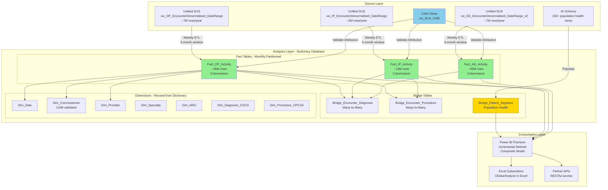
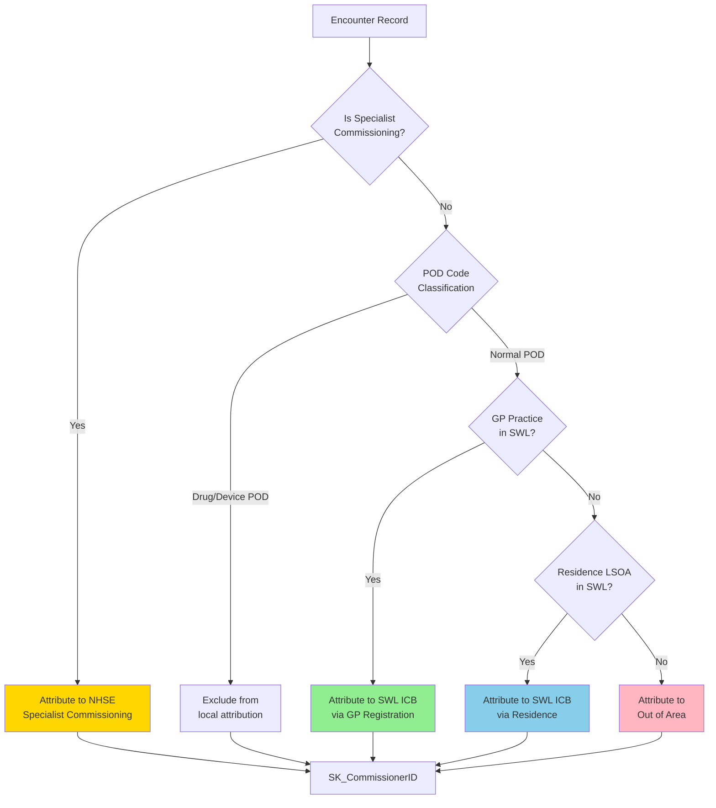
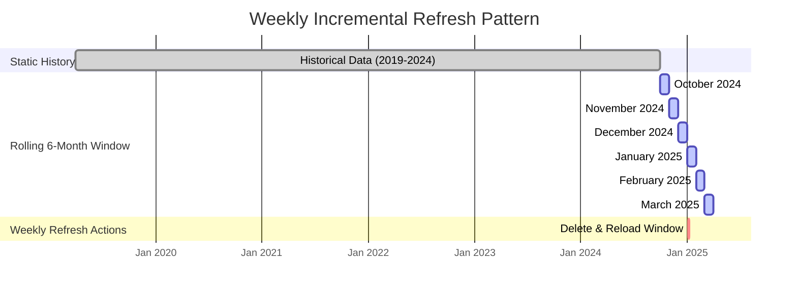
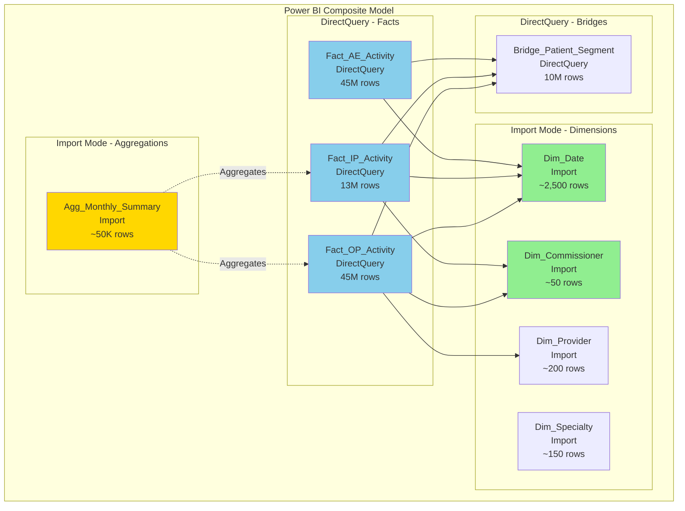

# SWL ICB HighSpring - Technical Specification (Current)

**Last Updated:** 2026-01-13

This document describes the **current implemented** HighSpring model in this repository.
It is intentionally pragmatic and code-aligned (deploy now, run loads later).

## 1. Target environment

- **Target DB:** `[Data_Lab_SWL_Live]`
- **Target schema:** `[Analytics]`
- **Execution:** SQL Server (2017+) via SQLCMD orchestration

## 2. What is deployed by this repo

The master deployment script is:

- [sql/analytics_platform/00_Run_Everything_SQLCMD.sql](../sql/analytics_platform/00_Run_Everything_SQLCMD.sql)

It creates:

- **Dimensions** (tables + views) under `[Analytics]`
    - `tbl_Dim_OpPlan_MeasureSet`
    - `vw_Dim_OpPlan_Measure`
- **Facts** (tables):
    - `[Analytics].[tbl_Fact_IP_Activity]`
    - `[Analytics].[tbl_Fact_OP_Activity]`
    - `[Analytics].[tbl_Fact_AE_Activity]`
- **Bridges** (tables):
    - `[Analytics].[tbl_Bridge_ERF_Activity]`
    - `[Analytics].[tbl_Bridge_Operating_Plan_Deferred]` (deprecated)
    - `[Analytics].[tbl_Bridge_OpPlan_MeasureSet]`
    - `[Analytics].[tbl_Bridge_CF_Segment_Patient_Snapshot]` (DDL only)
    - `[Analytics].[tbl_Bridge_CF_Segment_Patient_Snapshot]` (DDL only)
- **Precompute tables** (create-if-missing):
    - `[Analytics].[tbl_CAM_Assignment_Active]`
    - `[Analytics].[tbl_ERF_Repriced_Active]`
    - `[Analytics].[tbl_OpPlan_Active]`
- **ETL stored procedures** (create-only):
    - Facts: `sp_Load_Fact_IP_Activity`, `sp_Load_Fact_OP_Activity`, `sp_Load_Fact_AE_Activity`
    - Precompute: `sp_Load_CAM_Assignment_Active`, `sp_Load_ERF_Repriced_Active`, `sp_Load_OpPlan_Active`
    - Bridges: `sp_Load_Bridge_ERF_Activity`, `sp_Load_Bridge_Operating_Plan_Deferred` (deprecated)
    - Enrichment: `sp_Enrich_Facts_Operating_Plan`, `sp_Enrich_Facts_CAM`, `sp_Enrich_Facts_ERF`

## 3. Key design decisions (current)

- **Grain:** one row per encounter/attendance in each fact.
- **Keys:**
    - `SK_EncounterID` is sourced from upstream (not an `IDENTITY`).
    - `SK_PatientID` is numeric pseudonymised (sourced from upstream).
- **Constraints:** facts/bridges do not enforce FK constraints (performance + upstream variability).
- **Indexing:** clustered columnstore on the large tables.
- **Attribution:** CAM output is stored **as columns on IP/OP facts** via a post-load enrichment procedure.
- **Operating Plan:** `Is_Operating_Plan` + `SK_OpPlan_MeasureSet` stored on facts; MeasureID slicing via `tbl_Bridge_OpPlan_MeasureSet`.
- **ERF:** stored as flags + cost fields on facts via a precomputed repriced table.

## 4. Upstream dependencies

The fact/bridge loaders read from existing upstream objects in `[Data_Lab_SWL]`:

- Unified SUS denormalised encounter views (IP/OP/AE) and POD derivation via `[IP]/[OP].[GetPodType]`
- ERF repriced activity views (25/26): `Analytics.vw_IP_ERF`, `Analytics.vw_OP_ERF`
- Operating Plan TVFs: `PLNG.Get_OpPlan_ActivityBridge_IP_UfS`, `..._OP_...`, `..._ED_...`
- Operating Plan TVFs: `PLNG.Get_OpPlan_ActivityBridge_*_UfS`
- CAM function for enrichment: `Analytics.fn_CommissionerAssignment` (via CAM views/mapping)

## 5. Run order (manual loads)

Deployment creates objects and loads dimensions.
Facts/bridges/enrichment are executed manually, in this order:

```sql
EXEC [Analytics].[sp_Load_CAM_Assignment_Active]
    @FinYearStart = '2025',
    @FinancialYear = '2025/2026';

EXEC [Analytics].[sp_Load_ERF_Repriced_Active]
    @FinYearStart = '2025';

EXEC [Analytics].[sp_Load_OpPlan_Active]
    @FinYearStart = '2025';

EXEC [Analytics].[sp_Run_Fact_Loads_With_Enrichment]
    @FromDate = '2025-04-01',
    @ToDate = '2025-09-30',
    @FinYearStart = '2025',
    @FinancialYear = '2025/2026',
    @ProviderCode = NULL;

EXEC [Analytics].[sp_Load_Bridge_ERF_Activity] @FinYearStart = '2025';
```

Operating Plan deferred loader is **deprecated** and should not be executed.

## 6. Known gaps / decisions pending

- **Patient segmentation strategy:** Implemented via monthly patient snapshot (`tbl_Bridge_CF_Segment_Patient_Snapshot`).
    Deprecated: Agg + temporal bridges are retained for reference but not executed.
    Confirmed direction: **do not use `HI.vw_CF_Segmentation`**.
    Apply CF rules using Unified SUS IP/OP materialised tables (ICD10 only).
- **Operating Plan targets:** target sourcing is not yet implemented; define a target table at MeasureID + month (and optional org grain).

<!--
LEGACY CONTENT (archived)
The remainder of this file is preserved for historical context but is not current.

**Out of Scope:**
- Power BI report development (covered in separate BI specification)
- User training (covered in change management plan)
- Data quality framework implementation detail (covered in DQ specification)

---

## 2. Architecture Overview

### 2.1 Target State Architecture



### 2.2 Design Principles

**1. Star Schema with Bridges**
- Fact tables at grain of one encounter/attendance
- Bridge tables for many-to-many relationships (diagnoses, procedures, population segments)
- Conformed dimensions shared across facts

**2. Reuse Over Rebuild**
- Dictionary dimensions already exist - reuse with SK_/BK_ pattern
- HI schema population segments already calculated - integrate via bridge
- CAM attribution already implemented - consume outputs

**3. Performance-First Design**
- Monthly partitioning for efficient 6-month rolling deletes
- Columnstore indexes on fact tables for fast scans
- Pre-aggregated monthly summaries for dashboards
- Power BI incremental refresh (retain 2 years, refresh 3 months)

**4. Single Source of Truth**
- One attribution method (CAM) - no parallel competing logic
- One patient dimension (HI.vw_Practice_Patients_Details)
- One cost field (validated against SLAM)

---

## 3. Physical Data Model

### 3.1 Fact Tables

#### 3.1.1 Fact_OP_Activity

**Grain:** One row per outpatient appointment
**Volume:** ~45.5M rows (7M/year × 6.5 years)
**Partitioning:** Monthly by Appointment_Date
**Indexing:** Clustered columnstore + nonclustered rowstore on surrogate keys

```sql
CREATE TABLE [Analytics].[Fact_OP_Activity]
(
    -- Primary Key
    SK_EncounterID BIGINT NOT NULL,

    -- Dimensional Keys (11)
    SK_PatientID BIGINT NOT NULL,
    SK_AppointmentDateID INT NOT NULL,
    SK_CommissionerID INT NOT NULL,           -- CAM-validated attribution
    SK_ProviderID INT NOT NULL,
    SK_ProviderSiteID INT NULL,
    SK_SpecialtyID INT NULL,
    SK_TreatmentFunctionID INT NULL,
    SK_HRGID INT NULL,
    SK_ReferralSourceID INT NULL,
    SK_GPPracticeID INT NULL,
    SK_PodID INT NULL,                        -- Point of Delivery from CAM

    -- Date Fields (for partitioning & filtering)
    Appointment_Date DATE NOT NULL,
    Referral_Date DATE NULL,

    -- Measures (8)
    Appointments INT NOT NULL DEFAULT 1,
    Base_Activity_Cost DECIMAL(18,2) NULL,
    Total_Activity_Cost DECIMAL(18,2) NULL,  -- Including MFF
    Wait_Days_Referral_to_Appointment INT NULL,
    Age_At_Appointment INT NULL,
    DNA_Count AS CASE WHEN Is_DNA = 1 THEN 1 ELSE 0 END,
    First_Attendance_Count AS CASE WHEN Is_FirstAttendance = 1 THEN 1 ELSE 0 END,

    -- Flags (12)
    Is_DNA BIT NOT NULL DEFAULT 0,
    Is_FirstAttendance BIT NOT NULL DEFAULT 0,
    Is_FollowUp BIT NOT NULL DEFAULT 0,
    Is_Attended BIT NOT NULL DEFAULT 0,
    Is_SWL_Commissioner BIT NOT NULL DEFAULT 0,
    Is_SWL_Provider BIT NOT NULL DEFAULT 0,
    Is_SWL_GPPractice BIT NOT NULL DEFAULT 0,
    Is_SpecialistCommissioning BIT NOT NULL DEFAULT 0,
    Is_Elective BIT NULL,
    Is_Consultant_Led BIT NULL,
    Is_Telephone BIT NULL,
    Is_Video BIT NULL,

    -- Source System Fields
    Source_Unique_CDS_Identifier VARCHAR(50) NULL,
    Source_System VARCHAR(20) NOT NULL DEFAULT 'Unified_SUS',

    -- Audit Fields
    ETL_BatchID INT NOT NULL,
    ETL_LoadDateTime DATETIME2 NOT NULL DEFAULT GETDATE(),
    ETL_IsDeleted BIT NOT NULL DEFAULT 0,

    -- Constraints
    CONSTRAINT PK_Fact_OP_Activity PRIMARY KEY NONCLUSTERED (SK_EncounterID),
    CONSTRAINT FK_Fact_OP_Patient FOREIGN KEY (SK_PatientID)
        REFERENCES [Dictionary].[dbo].[Dim_Patient](SK_PatientID),
    CONSTRAINT FK_Fact_OP_Date FOREIGN KEY (SK_AppointmentDateID)
        REFERENCES [Dictionary].[dbo].[Dim_Date](DateID),
    CONSTRAINT FK_Fact_OP_Commissioner FOREIGN KEY (SK_CommissionerID)
        REFERENCES [Analytics].[Dim_Commissioner](SK_CommissionerID),
    CONSTRAINT FK_Fact_OP_Provider FOREIGN KEY (SK_ProviderID)
        REFERENCES [Dictionary].[dbo].[Dim_Provider](SK_ProviderID)
)
ON PS_OP_Activity_Monthly(Appointment_Date);

-- Clustered Columnstore for fast scans
CREATE CLUSTERED COLUMNSTORE INDEX CCI_Fact_OP_Activity
    ON [Analytics].[Fact_OP_Activity]
    WITH (DROP_EXISTING = OFF, COMPRESSION_DELAY = 0);

-- Nonclustered indexes for point lookups
CREATE NONCLUSTERED INDEX IX_Fact_OP_Patient
    ON [Analytics].[Fact_OP_Activity](SK_PatientID)
    INCLUDE (Appointment_Date, Total_Activity_Cost);

CREATE NONCLUSTERED INDEX IX_Fact_OP_Date
    ON [Analytics].[Fact_OP_Activity](Appointment_Date)
    INCLUDE (SK_CommissionerID, Total_Activity_Cost);

CREATE NONCLUSTERED INDEX IX_Fact_OP_Commissioner
    ON [Analytics].[Fact_OP_Activity](SK_CommissionerID, Appointment_Date)
    INCLUDE (Total_Activity_Cost);

CREATE STATISTICS ST_Fact_OP_LoadDateTime
    ON [Analytics].[Fact_OP_Activity](ETL_LoadDateTime);
```

**Partition Scheme for Monthly Partitioning:**
```sql
-- Partition function: One partition per month
CREATE PARTITION FUNCTION PF_OP_Activity_Monthly (DATE)
AS RANGE RIGHT FOR VALUES
(
    '2019-04-01', '2019-05-01', '2019-06-01', '2019-07-01', '2019-08-01', '2019-09-01',
    '2019-10-01', '2019-11-01', '2019-12-01', '2020-01-01', '2020-02-01', '2020-03-01',
    -- ... continue through 2026-03-01
    '2026-01-01', '2026-02-01', '2026-03-01'
);

-- Partition scheme: All on PRIMARY filegroup for simplicity
CREATE PARTITION SCHEME PS_OP_Activity_Monthly
AS PARTITION PF_OP_Activity_Monthly
ALL TO ([PRIMARY]);

-- Note: Monthly partitioning enables efficient deletion of old data
-- When refreshing 6-month window, TRUNCATE partitions 6+ months old
```

#### 3.1.2 Fact_IP_Activity

**Grain:** One row per inpatient spell (not episode)
**Volume:** ~13M rows (2M/year × 6.5 years)
**Partitioning:** Monthly by Discharge_Date
**Indexing:** Clustered columnstore + nonclustered rowstore

```sql
CREATE TABLE [Analytics].[Fact_IP_Activity]
(
    -- Primary Key
    SK_EncounterID BIGINT NOT NULL,

    -- Dimensional Keys (12)
    SK_PatientID BIGINT NOT NULL,
    SK_AdmissionDateID INT NOT NULL,
    SK_DischargeDateID INT NOT NULL,
    SK_CommissionerID INT NOT NULL,           -- CAM-validated
    SK_ProviderID INT NOT NULL,
    SK_ProviderSiteID INT NULL,
    SK_SpecialtyID INT NULL,
    SK_TreatmentFunctionID INT NULL,
    SK_HRGID INT NULL,                        -- Spell-level HRG
    SK_ReferralSourceID INT NULL,
    SK_GPPracticeID INT NULL,
    SK_PodID INT NULL,                        -- CAM POD

    -- Date Fields
    Admission_Date DATE NOT NULL,
    Discharge_Date DATE NOT NULL,

    -- Measures (10)
    Spells INT NOT NULL DEFAULT 1,
    Episodes_In_Spell INT NULL,
    Base_Activity_Cost DECIMAL(18,2) NULL,
    Total_Activity_Cost DECIMAL(18,2) NULL,
    Length_of_Stay_Days INT NULL,
    Age_At_Admission INT NULL,
    Wait_Days_Referral_to_Admission INT NULL,
    Elective_Wait_Days INT NULL,
    Bed_Days AS Length_of_Stay_Days,         -- Alias for clarity

    -- Flags (15)
    Is_Emergency BIT NOT NULL DEFAULT 0,
    Is_Elective BIT NOT NULL DEFAULT 0,
    Is_Day_Case BIT NOT NULL DEFAULT 0,
    Is_SWL_Commissioner BIT NOT NULL DEFAULT 0,
    Is_SWL_Provider BIT NOT NULL DEFAULT 0,
    Is_SWL_GPPractice BIT NOT NULL DEFAULT 0,
    Is_SpecialistCommissioning BIT NOT NULL DEFAULT 0,
    Is_Readmission_30Day BIT NULL,
    Is_Long_Stay BIT AS CASE WHEN Length_of_Stay_Days > 21 THEN 1 ELSE 0 END,
    Is_Maternity BIT NULL,
    Is_Mental_Health BIT NULL,

    -- Clinical Classification
    Admission_Method_Code VARCHAR(2) NULL,
    Patient_Classification_Code VARCHAR(1) NULL,  -- 1=Ordinary, 2=Day Case, etc.
    Discharge_Method_Code VARCHAR(1) NULL,

    -- Source System Fields
    Source_Unique_CDS_Identifier VARCHAR(50) NULL,
    Source_System VARCHAR(20) NOT NULL DEFAULT 'Unified_SUS',

    -- Audit Fields
    ETL_BatchID INT NOT NULL,
    ETL_LoadDateTime DATETIME2 NOT NULL DEFAULT GETDATE(),
    ETL_IsDeleted BIT NOT NULL DEFAULT 0,

    -- Constraints
    CONSTRAINT PK_Fact_IP_Activity PRIMARY KEY NONCLUSTERED (SK_EncounterID),
    CONSTRAINT FK_Fact_IP_Patient FOREIGN KEY (SK_PatientID)
        REFERENCES [Dictionary].[dbo].[Dim_Patient](SK_PatientID),
    CONSTRAINT FK_Fact_IP_AdmissionDate FOREIGN KEY (SK_AdmissionDateID)
        REFERENCES [Dictionary].[dbo].[Dim_Date](DateID),
    CONSTRAINT FK_Fact_IP_DischargeDate FOREIGN KEY (SK_DischargeDateID)
        REFERENCES [Dictionary].[dbo].[Dim_Date](DateID),
    CONSTRAINT FK_Fact_IP_Commissioner FOREIGN KEY (SK_CommissionerID)
        REFERENCES [Analytics].[Dim_Commissioner](SK_CommissionerID),
    CONSTRAINT CHK_Fact_IP_Dates CHECK (Discharge_Date >= Admission_Date)
)
ON PS_IP_Activity_Monthly(Discharge_Date);

-- Clustered Columnstore
CREATE CLUSTERED COLUMNSTORE INDEX CCI_Fact_IP_Activity
    ON [Analytics].[Fact_IP_Activity]
    WITH (COMPRESSION_DELAY = 0);

-- Nonclustered indexes
CREATE NONCLUSTERED INDEX IX_Fact_IP_Patient
    ON [Analytics].[Fact_IP_Activity](SK_PatientID)
    INCLUDE (Admission_Date, Discharge_Date, Total_Activity_Cost);

CREATE NONCLUSTERED INDEX IX_Fact_IP_DischargeDate
    ON [Analytics].[Fact_IP_Activity](Discharge_Date)
    INCLUDE (SK_CommissionerID, Total_Activity_Cost, Length_of_Stay_Days);

CREATE NONCLUSTERED INDEX IX_Fact_IP_Commissioner
    ON [Analytics].[Fact_IP_Activity](SK_CommissionerID, Discharge_Date)
    INCLUDE (Total_Activity_Cost, Length_of_Stay_Days);
```

#### 3.1.3 Fact_AE_Activity

**Grain:** One row per A&E attendance
**Volume:** ~45.5M rows (7M/year × 6.5 years)
**Partitioning:** Monthly by Arrival_Date
**Indexing:** Clustered columnstore + nonclustered rowstore

```sql
CREATE TABLE [Analytics].[Fact_AE_Activity]
(
    -- Primary Key
    SK_EncounterID BIGINT NOT NULL,

    -- Dimensional Keys (10)
    SK_PatientID BIGINT NOT NULL,
    SK_ArrivalDateID INT NOT NULL,
    SK_DepartureDateID INT NULL,
    SK_CommissionerID INT NOT NULL,           -- CAM-validated
    SK_ProviderID INT NOT NULL,
    SK_ProviderSiteID INT NULL,
    SK_GPPracticeID INT NULL,
    SK_AttendanceCategoryID INT NULL,         -- Type 1/2/3/4
    SK_AttendanceDisposalID INT NULL,         -- Outcome
    SK_PodID INT NULL,

    -- Date Fields
    Arrival_Date DATE NOT NULL,
    Arrival_DateTime DATETIME2 NULL,
    Departure_DateTime DATETIME2 NULL,

    -- Measures (8)
    Attendances INT NOT NULL DEFAULT 1,
    Total_Activity_Cost DECIMAL(18,2) NULL,
    Age_At_Arrival INT NULL,
    Time_in_Department_Minutes INT NULL,
    Wait_Time_to_Treatment_Minutes INT NULL,
    Four_Hour_Breaches AS CASE WHEN Time_in_Department_Minutes > 240 THEN 1 ELSE 0 END,

    -- Flags (12)
    Is_Emergency BIT NOT NULL DEFAULT 0,
    Is_SWL_Commissioner BIT NOT NULL DEFAULT 0,
    Is_SWL_Provider BIT NOT NULL DEFAULT 0,
    Is_SWL_GPPractice BIT NOT NULL DEFAULT 0,
    Is_Admitted BIT NULL,
    Is_Left_Before_Treatment BIT NULL,
    Is_Type1_Department BIT NULL,             -- Major A&E
    Is_Type2_Department BIT NULL,             -- Single Specialty
    Is_Type3_Department BIT NULL,             -- Walk-in Centre/MIU
    Is_Ambulance_Arrival BIT NULL,
    Is_4Hour_Breach BIT AS CASE WHEN Time_in_Department_Minutes > 240 THEN 1 ELSE 0 END,
    Is_Frequent_Attender BIT NULL,            -- 4+ visits in 12 months

    -- Clinical Classification (SNOMED CT for ECDS)
    Chief_Complaint_SNOMED VARCHAR(20) NULL,
    Diagnosis_SNOMED VARCHAR(20) NULL,
    Acuity_Code VARCHAR(2) NULL,              -- 1=Resuscitation to 5=Non-urgent

    -- Source System Fields
    Source_Unique_CDS_Identifier VARCHAR(50) NULL,
    Source_System VARCHAR(20) NOT NULL DEFAULT 'Unified_SUS',

    -- Audit Fields
    ETL_BatchID INT NOT NULL,
    ETL_LoadDateTime DATETIME2 NOT NULL DEFAULT GETDATE(),
    ETL_IsDeleted BIT NOT NULL DEFAULT 0,

    -- Constraints
    CONSTRAINT PK_Fact_AE_Activity PRIMARY KEY NONCLUSTERED (SK_EncounterID),
    CONSTRAINT FK_Fact_AE_Patient FOREIGN KEY (SK_PatientID)
        REFERENCES [Dictionary].[dbo].[Dim_Patient](SK_PatientID),
    CONSTRAINT FK_Fact_AE_ArrivalDate FOREIGN KEY (SK_ArrivalDateID)
        REFERENCES [Dictionary].[dbo].[Dim_Date](DateID),
    CONSTRAINT FK_Fact_AE_Commissioner FOREIGN KEY (SK_CommissionerID)
        REFERENCES [Analytics].[Dim_Commissioner](SK_CommissionerID)
)
ON PS_AE_Activity_Monthly(Arrival_Date);

-- Clustered Columnstore
CREATE CLUSTERED COLUMNSTORE INDEX CCI_Fact_AE_Activity
    ON [Analytics].[Fact_AE_Activity]
    WITH (COMPRESSION_DELAY = 0);

-- Nonclustered indexes
CREATE NONCLUSTERED INDEX IX_Fact_AE_Patient
    ON [Analytics].[Fact_AE_Activity](SK_PatientID)
    INCLUDE (Arrival_Date, Total_Activity_Cost);

CREATE NONCLUSTERED INDEX IX_Fact_AE_ArrivalDate
    ON [Analytics].[Fact_AE_Activity](Arrival_Date)
    INCLUDE (SK_CommissionerID, Total_Activity_Cost, Time_in_Department_Minutes);

CREATE NONCLUSTERED INDEX IX_Fact_AE_Commissioner
    ON [Analytics].[Fact_AE_Activity](SK_CommissionerID, Arrival_Date)
    INCLUDE (Total_Activity_Cost);
```

### 3.2 Bridge Tables

#### 3.2.1 Bridge_Encounter_Diagnosis

**Purpose:** Many-to-many relationship between encounters and diagnoses
**Volume:** ~250M rows (avg 2.5 diagnoses per IP spell, 1 per OP/AE)
**Indexing:** Nonclustered on both keys

```sql
CREATE TABLE [Analytics].[Bridge_Encounter_Diagnosis]
(
    -- Composite Primary Key
    SK_EncounterID BIGINT NOT NULL,
    SK_DiagnosisID INT NOT NULL,
    Diagnosis_Position TINYINT NOT NULL,      -- 1=Primary, 2-20=Secondary

    -- Diagnosis Details
    Dataset VARCHAR(2) NOT NULL,              -- 'IP', 'OP', 'AE'
    Diagnosis_Code VARCHAR(10) NOT NULL,      -- ICD-10 code
    Is_Primary_Diagnosis BIT NOT NULL DEFAULT 0,

    -- Audit Fields
    ETL_BatchID INT NOT NULL,
    ETL_LoadDateTime DATETIME2 NOT NULL DEFAULT GETDATE(),

    -- Constraints
    CONSTRAINT PK_Bridge_Encounter_Diagnosis
        PRIMARY KEY CLUSTERED (SK_EncounterID, Diagnosis_Position),
    CONSTRAINT FK_Bridge_Diagnosis_Encounter_IP
        FOREIGN KEY (SK_EncounterID)
        REFERENCES [Analytics].[Fact_IP_Activity](SK_EncounterID),
    CONSTRAINT FK_Bridge_Diagnosis_Dim
        FOREIGN KEY (SK_DiagnosisID)
        REFERENCES [Dictionary].[dbo].[Dim_Diagnosis_ICD10](SK_DiagnosisID),
    CONSTRAINT CHK_Bridge_Diagnosis_Position
        CHECK (Diagnosis_Position BETWEEN 1 AND 20),
    CONSTRAINT CHK_Bridge_Diagnosis_Dataset
        CHECK (Dataset IN ('IP', 'OP', 'AE'))
);

-- Nonclustered index for reverse lookup (all encounters for a diagnosis)
CREATE NONCLUSTERED INDEX IX_Bridge_Diagnosis_Reverse
    ON [Analytics].[Bridge_Encounter_Diagnosis](SK_DiagnosisID, Is_Primary_Diagnosis)
    INCLUDE (SK_EncounterID, Dataset);

-- Statistics for optimizer
CREATE STATISTICS ST_Bridge_Diagnosis_Code
    ON [Analytics].[Bridge_Encounter_Diagnosis](Diagnosis_Code);
```

#### 3.2.2 Bridge_Encounter_Procedure

**Purpose:** Many-to-many relationship between encounters and procedures
**Volume:** ~150M rows (avg 1.5 procedures per IP spell, sparse for OP)
**Indexing:** Nonclustered on both keys

```sql
CREATE TABLE [Analytics].[Bridge_Encounter_Procedure]
(
    -- Composite Primary Key
    SK_EncounterID BIGINT NOT NULL,
    SK_ProcedureID INT NOT NULL,
    Procedure_Position TINYINT NOT NULL,      -- 1=Primary, 2-24=Secondary

    -- Procedure Details
    Dataset VARCHAR(2) NOT NULL,              -- 'IP', 'OP'
    Procedure_Code VARCHAR(10) NOT NULL,      -- OPCS-4 code
    Is_Primary_Procedure BIT NOT NULL DEFAULT 0,
    Procedure_Date DATE NULL,

    -- Audit Fields
    ETL_BatchID INT NOT NULL,
    ETL_LoadDateTime DATETIME2 NOT NULL DEFAULT GETDATE(),

    -- Constraints
    CONSTRAINT PK_Bridge_Encounter_Procedure
        PRIMARY KEY CLUSTERED (SK_EncounterID, Procedure_Position),
    CONSTRAINT FK_Bridge_Procedure_Encounter_IP
        FOREIGN KEY (SK_EncounterID)
        REFERENCES [Analytics].[Fact_IP_Activity](SK_EncounterID),
    CONSTRAINT FK_Bridge_Procedure_Dim
        FOREIGN KEY (SK_ProcedureID)
        REFERENCES [Dictionary].[dbo].[Dim_Procedure_OPCS4](SK_ProcedureID),
    CONSTRAINT CHK_Bridge_Procedure_Position
        CHECK (Procedure_Position BETWEEN 1 AND 24),
    CONSTRAINT CHK_Bridge_Procedure_Dataset
        CHECK (Dataset IN ('IP', 'OP'))
);

-- Nonclustered index for reverse lookup
CREATE NONCLUSTERED INDEX IX_Bridge_Procedure_Reverse
    ON [Analytics].[Bridge_Encounter_Procedure](SK_ProcedureID, Is_Primary_Procedure)
    INCLUDE (SK_EncounterID, Dataset, Procedure_Date);
```

#### 3.2.3 Bridge_Patient_Segment

**Purpose:** Many-to-many relationship between patients and population health segments
**Source:** HI schema (vw_CF_Segmentation, vw_Core20, vw_LongTermConditions, vw_FrequentAttenders)
**Volume:** ~10M rows (avg 5 segments per patient)
**Time-Variance:** Type 2 SCD with Valid_From/Valid_To

```sql
CREATE TABLE [Analytics].[Bridge_Patient_Segment]
(
    -- Surrogate Key
    SK_Patient_Segment_ID BIGINT IDENTITY(1,1) NOT NULL,

    -- Patient Reference
    SK_PatientID BIGINT NOT NULL,

    -- Segment Classification
    Segment_Type VARCHAR(50) NOT NULL,        -- 'CLSP', 'Core20', 'LTC', 'HIU', 'Maternity'
    Segment_Value VARCHAR(100) NOT NULL,      -- e.g., 'Frailty', 'Diabetes', 'Frequent Attender'
    Segment_Code VARCHAR(20) NULL,            -- Optional numeric code

    -- Time Variance (Type 2 SCD)
    Valid_From DATE NOT NULL,
    Valid_To DATE NULL,                       -- NULL = currently active
    Is_Current BIT NOT NULL DEFAULT 1,

    -- Source Tracking
    Data_Source VARCHAR(100) NOT NULL,        -- 'HI.vw_CF_Segmentation', 'HI.vw_LongTermConditions'
    Source_Reference_ID VARCHAR(50) NULL,

    -- Audit Fields
    ETL_BatchID INT NOT NULL,
    ETL_LoadDateTime DATETIME2 NOT NULL DEFAULT GETDATE(),
    ETL_IsDeleted BIT NOT NULL DEFAULT 0,

    -- Constraints
    CONSTRAINT PK_Bridge_Patient_Segment
        PRIMARY KEY CLUSTERED (SK_Patient_Segment_ID),
    CONSTRAINT FK_Bridge_Segment_Patient
        FOREIGN KEY (SK_PatientID)
        REFERENCES [Dictionary].[dbo].[Dim_Patient](SK_PatientID),
    CONSTRAINT CHK_Bridge_Segment_Dates
        CHECK (Valid_To IS NULL OR Valid_To >= Valid_From),
    CONSTRAINT CHK_Bridge_Segment_Current
        CHECK ((Is_Current = 1 AND Valid_To IS NULL) OR (Is_Current = 0 AND Valid_To IS NOT NULL))
);

-- Nonclustered indexes for common queries
CREATE NONCLUSTERED INDEX IX_Bridge_Segment_Patient
    ON [Analytics].[Bridge_Patient_Segment](SK_PatientID, Is_Current)
    INCLUDE (Segment_Type, Segment_Value, Valid_From, Valid_To);

CREATE NONCLUSTERED INDEX IX_Bridge_Segment_Type
    ON [Analytics].[Bridge_Patient_Segment](Segment_Type, Segment_Value, Is_Current)
    INCLUDE (SK_PatientID);

CREATE NONCLUSTERED INDEX IX_Bridge_Segment_Dates
    ON [Analytics].[Bridge_Patient_Segment](Valid_From, Valid_To)
    INCLUDE (SK_PatientID, Segment_Type, Segment_Value)
    WHERE Is_Current = 1;

-- Statistics
CREATE STATISTICS ST_Bridge_Segment_Source
    ON [Analytics].[Bridge_Patient_Segment](Data_Source);
```

### 3.3 Dimension Strategy

**Reuse Existing Dictionary Dimensions** (no need to recreate):
- `[Dictionary].[dbo].[Dim_Date]` - Complete date dimension (SK=DateID, BK=Date)
- `[Dictionary].[dbo].[Dim_Patient]` - Patient dimension (SK=SK_PatientID, BK=NHS_Number_Patient_Identifier)
- `[Dictionary].[dbo].[Dim_Provider]` - Organisation Code Provider
- `[Dictionary].[dbo].[Dim_Specialty]` - Main Specialty Code
- `[Dictionary].[dbo].[Dim_HRG]` - Healthcare Resource Groups
- `[Dictionary].[dbo].[Dim_Diagnosis_ICD10]` - ICD-10 diagnosis codes
- `[Dictionary].[dbo].[Dim_Procedure_OPCS4]` - OPCS-4 procedure codes
- `[Dictionary].[dbo].[Dim_Ethnicity]` - Type 2 SCD with Valid_From/Valid_To
- `[Dictionary].[dbo].[Dim_LSOA]` - Geographic lower super output areas
- `[Dictionary].[dbo].[Dim_GP_Practice]` - GP practice registrations

**New Dimension Required: Dim_Commissioner (CAM-validated)**

```sql
CREATE TABLE [Analytics].[Dim_Commissioner]
(
    -- Surrogate Key
    SK_CommissionerID INT IDENTITY(1,1) NOT NULL,

    -- Business Keys
    Commissioner_Code VARCHAR(10) NOT NULL,   -- ICB/Sub-ICB code
    Commissioner_Name VARCHAR(255) NULL,

    -- Hierarchy
    ICB_Code VARCHAR(3) NULL,                 -- Parent ICB (e.g., 'QWE')
    ICB_Name VARCHAR(255) NULL,
    SubICB_Code VARCHAR(5) NULL,              -- Sub-location code
    SubICB_Name VARCHAR(255) NULL,

    -- Classification
    Organisation_Type VARCHAR(50) NULL,       -- 'ICB', 'Sub-ICB', 'Out of Area'
    Region_Code VARCHAR(10) NULL,             -- NHS England region
    Region_Name VARCHAR(100) NULL,

    -- SWL Flags
    Is_SWL_ICB BIT NOT NULL DEFAULT 0,
    Is_Out_of_Area BIT NOT NULL DEFAULT 0,

    -- CAM Attribution
    CAM_Attribution_Method VARCHAR(50) NULL,  -- 'GP_Registration', 'Residence', 'Specialist_Comm'

    -- Type 1 SCD Fields
    Valid_From DATE NOT NULL DEFAULT '1900-01-01',
    Valid_To DATE NULL DEFAULT '9999-12-31',
    Is_Current BIT NOT NULL DEFAULT 1,

    -- Audit Fields
    Source_System VARCHAR(50) NULL DEFAULT 'ODS',
    ETL_LoadDateTime DATETIME2 NOT NULL DEFAULT GETDATE(),

    -- Constraints
    CONSTRAINT PK_Dim_Commissioner PRIMARY KEY CLUSTERED (SK_CommissionerID),
    CONSTRAINT UQ_Dim_Commissioner_Code UNIQUE (Commissioner_Code, Valid_From)
);

-- Default record for missing/unknown commissioner
INSERT INTO [Analytics].[Dim_Commissioner]
    (SK_CommissionerID, Commissioner_Code, Commissioner_Name, Is_Out_of_Area)
VALUES
    (-1, 'UNKNOWN', 'Unknown Commissioner', 0);

-- Nonclustered index
CREATE NONCLUSTERED INDEX IX_Dim_Commissioner_Code
    ON [Analytics].[Dim_Commissioner](Commissioner_Code, Is_Current);
```

**New Dimension: Dim_POD (Point of Delivery for CAM)**

```sql
CREATE TABLE [Analytics].[Dim_POD]
(
    -- Surrogate Key
    SK_PodID INT IDENTITY(1,1) NOT NULL,

    -- Business Key
    POD_Code VARCHAR(20) NOT NULL,

    -- Attributes
    POD_Description VARCHAR(255) NULL,
    POD_Category VARCHAR(50) NULL,            -- 'Elective', 'Non-Elective', 'Outpatient', etc.

    -- CAM Flags
    Is_Specialist_Commissioning BIT NOT NULL DEFAULT 0,
    Is_Emergency BIT NOT NULL DEFAULT 0,

    -- Audit
    Source_System VARCHAR(50) NULL DEFAULT 'CAM',
    ETL_LoadDateTime DATETIME2 NOT NULL DEFAULT GETDATE(),

    CONSTRAINT PK_Dim_POD PRIMARY KEY CLUSTERED (SK_PodID),
    CONSTRAINT UQ_Dim_POD_Code UNIQUE (POD_Code)
);
```

---

## 4. CAM (Commissioner Assignment Method) Integration

### 4.1 CAM Overview

**Purpose:** NHS England official methodology for determining "who pays" for each healthcare encounter
**Implementation:** Already exists in sql/cam/ folder with views and POD functions
**Decision:** **Reuse existing CAM implementation** rather than rebuild

### 4.2 CAM Attribution Waterfall Logic



### 4.3 POD (Point of Delivery) Classification Functions

**IP POD Function:**
```sql
-- Existing function: [IP].[GetPodType]
-- Input: Admission_Method, Patient_Classification, Intended_Management,
--        Start_Date, End_Date, HRG
-- Output: POD code (e.g., 'DC', 'EL', 'NEL', 'DRUG', 'DEVICE')

-- Example usage in Fact_IP ETL:
SELECT
    [IP].[GetPodType](
        Admission_Method_Hospital_Provider_Spell,
        Patient_Classification,
        Intended_Management,
        Start_Date_Hospital_Provider_Spell,
        End_Date_Hospital_Provider_Spell,
        Spell_Core_HRG
    ) AS POD_Code
FROM [Data_Store_SUS_Unified].[Unified].[vw_IP_EncounterDenormalised_DateRange]
```

**OP POD Function:**
```sql
-- Existing function: [OP].[GetPodType]
-- Input: HRG, Attended_DNA, First_Attendance, Main_Specialty
-- Output: POD code

-- Example usage in Fact_OP ETL:
SELECT
    [OP].[GetPodType](
        Core_HRG,
        Attended_Or_Did_Not_Attend,
        First_Attendance,
        Main_Specialty_Code
    ) AS POD_Code
FROM [Data_Store_SUS_Unified].[Unified].[vw_OP_EncounterDenormalised_DateRange]
```

### 4.4 CAM Integration Approach

**Option A: Direct CAM View Consumption (RECOMMENDED)**

Use existing CAM views to validate and derive commissioner assignment:

```sql
-- Fact_OP ETL with CAM integration
INSERT INTO [Analytics].[Fact_OP_Activity]
(
    SK_EncounterID,
    SK_CommissionerID,
    SK_PodID,
    ...
)
SELECT
    us.SK_EncounterID,

    -- Use CAM-validated commissioner
    COALESCE(dc.SK_CommissionerID, -1) AS SK_CommissionerID,

    -- Use CAM POD classification
    COALESCE(dp.SK_PodID, -1) AS SK_PodID,

    ...
FROM [Data_Store_SUS_Unified].[Unified].[vw_OP_EncounterDenormalised_DateRange] us

-- Join to CAM view for validated attribution
LEFT JOIN [CAM].[vw_SUS_CAM] cam
    ON us.SK_EncounterID = cam.PLD_ident
    AND cam.Dataset = 'OP'

-- Lookup commissioner dimension
LEFT JOIN [Analytics].[Dim_Commissioner] dc
    ON cam.RAW_Commissioner_Code = dc.Commissioner_Code
    AND dc.Is_Current = 1

-- Lookup POD dimension
LEFT JOIN [Analytics].[Dim_POD] dp
    ON cam.RAW_national_pod_code = dp.POD_Code

WHERE us.Appointment_Date BETWEEN @RefreshStartDate AND @RefreshEndDate;
```

**Benefits of Option A:**
- Reuses existing CAM logic (already validated by Finance)
- No need to duplicate POD classification functions
- NHS England CAM updates flow through automatically
- Reduces maintenance burden

### 4.5 Specialist Commissioning Handling

**NHSE Service Lines** requiring specialist commissioning attribution:
- Stored in `[dv_SpecCom_ServiceCode_National_Spell]` (IP) and `[dv_SpecCom_ServiceCode_National]` (OP)
- CAM view already flags these: `STP_NHSE_ServiceLine` field

**ETL Logic:**
```sql
-- Flag specialist commissioning in fact tables
CASE
    WHEN cam.STP_NHSE_ServiceLine IS NOT NULL
         AND cam.STP_NHSE_ServiceLine <> ''
    THEN 1
    ELSE 0
END AS Is_SpecialistCommissioning
```

---

## 5. ETL Specification

### 5.1 Weekly Refresh Strategy

**Objective:** Refresh last 6 months of data weekly to align with Unified SUS updates

**Refresh Pattern:**


**Benefits:**
- **Performance:** Only process ~12M rows/week vs 96M full reload
- **Data Quality:** Late-arriving SUS data (up to 6 months) captured
- **Efficiency:** Partition-level truncate vs row-by-row delete
- **Flexibility:** Can extend window if needed (e.g., 9 months for year-end)

### 5.2 Master ETL Orchestration

**Weekly Job Schedule (SQL Agent):**
```sql
-- Job Name: SWL_Analytics_Weekly_Refresh
-- Schedule: Every Sunday 02:00 AM
-- Estimated Duration: 3-4 hours

CREATE PROCEDURE [Analytics].[sp_Weekly_Refresh_Master]
    @OverrideRefreshMonths INT = 6  -- Default to 6-month window
AS
BEGIN
    SET NOCOUNT ON;

    DECLARE @StartTime DATETIME2 = GETDATE();
    DECLARE @BatchID INT;
    DECLARE @RefreshStartDate DATE;
    DECLARE @RefreshEndDate DATE;
    DECLARE @ErrorMessage NVARCHAR(4000);

    BEGIN TRY
        -- Calculate 6-month rolling window
        SET @RefreshEndDate = EOMONTH(GETDATE());  -- End of current month
        SET @RefreshStartDate = DATEADD(MONTH, -@OverrideRefreshMonths,
                                        DATEADD(DAY, 1, EOMONTH(@RefreshEndDate, -1)));

        -- Generate batch ID
        INSERT INTO [Analytics].[tbl_ETL_Batch_Log] (Batch_Start_DateTime, Refresh_Window_Start, Refresh_Window_End)
        VALUES (@StartTime, @RefreshStartDate, @RefreshEndDate);
        SET @BatchID = SCOPE_IDENTITY();

        PRINT 'Starting weekly refresh for window: ' + CAST(@RefreshStartDate AS VARCHAR)
              + ' to ' + CAST(@RefreshEndDate AS VARCHAR);

        -- Step 1: Pre-Refresh Validation
        EXEC [Analytics].[sp_PreRefresh_Validation]
            @RefreshStartDate = @RefreshStartDate,
            @RefreshEndDate = @RefreshEndDate,
            @BatchID = @BatchID;

        -- Step 2: Truncate partitions in 6-month window
        EXEC [Analytics].[sp_Truncate_Partitions_In_Window]
            @RefreshStartDate = @RefreshStartDate,
            @RefreshEndDate = @RefreshEndDate,
            @BatchID = @BatchID;

        -- Step 3: Refresh Fact_OP_Activity
        EXEC [Analytics].[sp_Refresh_Fact_OP_Activity]
            @RefreshStartDate = @RefreshStartDate,
            @RefreshEndDate = @RefreshEndDate,
            @BatchID = @BatchID;

        -- Step 4: Refresh Fact_IP_Activity
        EXEC [Analytics].[sp_Refresh_Fact_IP_Activity]
            @RefreshStartDate = @RefreshStartDate,
            @RefreshEndDate = @RefreshEndDate,
            @BatchID = @BatchID;

        -- Step 5: Refresh Fact_AE_Activity
        EXEC [Analytics].[sp_Refresh_Fact_AE_Activity]
            @RefreshStartDate = @RefreshStartDate,
            @RefreshEndDate = @RefreshEndDate,
            @BatchID = @BatchID;

        -- Step 6: Refresh Bridge_Encounter_Diagnosis
        EXEC [Analytics].[sp_Refresh_Bridge_Diagnosis]
            @RefreshStartDate = @RefreshStartDate,
            @RefreshEndDate = @RefreshEndDate,
            @BatchID = @BatchID;

        -- Step 7: Refresh Bridge_Encounter_Procedure
        EXEC [Analytics].[sp_Refresh_Bridge_Procedure]
            @RefreshStartDate = @RefreshStartDate,
            @RefreshEndDate = @RefreshEndDate,
            @BatchID = @BatchID;

        -- Step 8: Refresh Bridge_Patient_Segment (from HI schema)
        EXEC [Analytics].[sp_Refresh_Bridge_Patient_Segment]
            @BatchID = @BatchID;  -- No date filter - reload all current segments

        -- Step 9: Post-Refresh Validation
        EXEC [Analytics].[sp_PostRefresh_Validation]
            @RefreshStartDate = @RefreshStartDate,
            @RefreshEndDate = @RefreshEndDate,
            @BatchID = @BatchID;

        -- Step 10: Update Statistics
        EXEC [Analytics].[sp_Update_Statistics_All_Tables];

        -- Log success
        UPDATE [Analytics].[tbl_ETL_Batch_Log]
        SET Batch_End_DateTime = GETDATE(),
            Batch_Status = 'SUCCESS',
            Rows_Processed = (SELECT SUM(Rows_Inserted)
                              FROM [Analytics].[tbl_ETL_Table_Log]
                              WHERE Batch_ID = @BatchID)
        WHERE Batch_ID = @BatchID;

        PRINT 'Weekly refresh completed successfully. BatchID: ' + CAST(@BatchID AS VARCHAR);

    END TRY
    BEGIN CATCH
        -- Log error
        SET @ErrorMessage = ERROR_MESSAGE();

        UPDATE [Analytics].[tbl_ETL_Batch_Log]
        SET Batch_End_DateTime = GETDATE(),
            Batch_Status = 'FAILED',
            Error_Message = @ErrorMessage
        WHERE Batch_ID = @BatchID;

        -- Re-raise error
        THROW;
    END CATCH
END;
GO
```

### 5.3 Partition Truncate Strategy

**Efficient Delete Using Partition Switching:**
```sql
CREATE PROCEDURE [Analytics].[sp_Truncate_Partitions_In_Window]
    @RefreshStartDate DATE,
    @RefreshEndDate DATE,
    @BatchID INT
AS
BEGIN
    SET NOCOUNT ON;

    DECLARE @PartitionNumber INT;
    DECLARE @PartitionDate DATE;
    DECLARE @SQL NVARCHAR(MAX);

    -- Create temp staging tables with same structure but no data
    IF OBJECT_ID('tempdb..#Staging_OP') IS NOT NULL DROP TABLE #Staging_OP;
    IF OBJECT_ID('tempdb..#Staging_IP') IS NOT NULL DROP TABLE #Staging_IP;
    IF OBJECT_ID('tempdb..#Staging_AE') IS NOT NULL DROP TABLE #Staging_AE;

    -- Iterate through months in refresh window
    DECLARE partition_cursor CURSOR FOR
    SELECT DISTINCT
        DATEFROMPARTS(YEAR(d), MONTH(d), 1) AS PartitionMonth
    FROM (
        SELECT DATEADD(MONTH, n, @RefreshStartDate) AS d
        FROM (SELECT TOP (DATEDIFF(MONTH, @RefreshStartDate, @RefreshEndDate) + 1)
              ROW_NUMBER() OVER (ORDER BY (SELECT NULL)) - 1 AS n
              FROM sys.objects) nums
    ) dates
    WHERE d <= @RefreshEndDate;

    OPEN partition_cursor;
    FETCH NEXT FROM partition_cursor INTO @PartitionDate;

    WHILE @@FETCH_STATUS = 0
    BEGIN
        -- Get partition number for this date
        SELECT @PartitionNumber = $PARTITION.PF_OP_Activity_Monthly(@PartitionDate);

        PRINT 'Truncating partition ' + CAST(@PartitionNumber AS VARCHAR)
              + ' for month ' + CAST(@PartitionDate AS VARCHAR);

        -- Switch out partitions to staging (fast operation)
        -- Fact_OP
        SET @SQL = 'ALTER TABLE [Analytics].[Fact_OP_Activity]
                    SWITCH PARTITION ' + CAST(@PartitionNumber AS VARCHAR) +
                   ' TO [Analytics].[Fact_OP_Activity_Staging] PARTITION ' + CAST(@PartitionNumber AS VARCHAR);
        EXEC sp_executesql @SQL;

        -- Truncate staging (fast)
        TRUNCATE TABLE [Analytics].[Fact_OP_Activity_Staging];

        -- Repeat for IP and AE...

        FETCH NEXT FROM partition_cursor INTO @PartitionDate;
    END;

    CLOSE partition_cursor;
    DEALLOCATE partition_cursor;

    -- Log partition truncation
    INSERT INTO [Analytics].[tbl_ETL_Table_Log] (Batch_ID, Table_Name, Operation, Rows_Affected)
    VALUES (@BatchID, 'Partitions_Truncated', 'TRUNCATE', @@ROWCOUNT);
END;
GO
```

### 5.4 Fact_OP_Activity ETL

```sql
CREATE PROCEDURE [Analytics].[sp_Refresh_Fact_OP_Activity]
    @RefreshStartDate DATE,
    @RefreshEndDate DATE,
    @BatchID INT
AS
BEGIN
    SET NOCOUNT ON;

    DECLARE @RowsInserted INT = 0;
    DECLARE @StartTime DATETIME2 = GETDATE();

    -- Insert into Fact_OP_Activity
    INSERT INTO [Analytics].[Fact_OP_Activity] WITH (TABLOCK)
    (
        SK_EncounterID,
        SK_PatientID,
        SK_AppointmentDateID,
        SK_CommissionerID,
        SK_ProviderID,
        SK_ProviderSiteID,
        SK_SpecialtyID,
        SK_TreatmentFunctionID,
        SK_HRGID,
        SK_ReferralSourceID,
        SK_GPPracticeID,
        SK_PodID,
        Appointment_Date,
        Referral_Date,
        Appointments,
        Base_Activity_Cost,
        Total_Activity_Cost,
        Wait_Days_Referral_to_Appointment,
        Age_At_Appointment,
        Is_DNA,
        Is_FirstAttendance,
        Is_FollowUp,
        Is_Attended,
        Is_SWL_Commissioner,
        Is_SWL_Provider,
        Is_SWL_GPPractice,
        Is_SpecialistCommissioning,
        Is_Consultant_Led,
        Source_Unique_CDS_Identifier,
        ETL_BatchID
    )
    SELECT
        -- Primary Key
        us.SK_EncounterID,

        -- Dimensional Keys (with Dictionary dimension lookups)
        COALESCE(dp.SK_PatientID, -1) AS SK_PatientID,
        COALESCE(dd.DateID, -1) AS SK_AppointmentDateID,
        COALESCE(dc.SK_CommissionerID, -1) AS SK_CommissionerID,  -- CAM-validated
        COALESCE(dpr.SK_ProviderID, -1) AS SK_ProviderID,
        COALESCE(dps.SK_ProviderSiteID, -1) AS SK_ProviderSiteID,
        COALESCE(ds.SK_SpecialtyID, -1) AS SK_SpecialtyID,
        COALESCE(dtf.SK_TreatmentFunctionID, -1) AS SK_TreatmentFunctionID,
        COALESCE(dh.SK_HRGID, -1) AS SK_HRGID,
        COALESCE(drs.SK_ReferralSourceID, -1) AS SK_ReferralSourceID,
        COALESCE(dgp.SK_GPPracticeID, -1) AS SK_GPPracticeID,
        COALESCE(dpod.SK_PodID, -1) AS SK_PodID,  -- CAM POD

        -- Date Fields
        us.Appointment_Date,
        us.Referral_Request_Received_Date AS Referral_Date,

        -- Measures
        1 AS Appointments,
        us.dv_BaseActivityCost AS Base_Activity_Cost,
        us.dv_Total_Cost_Inc_MFF AS Total_Activity_Cost,
        DATEDIFF(DAY, us.Referral_Request_Received_Date, us.Appointment_Date) AS Wait_Days_Referral_to_Appointment,
        us.Age_At_CDS_Activity_Date AS Age_At_Appointment,

        -- Flags
        CASE WHEN us.Attended_Or_Did_Not_Attend = '2' THEN 1 ELSE 0 END AS Is_DNA,
        CASE WHEN us.First_Attendance IN ('1', '3') THEN 1 ELSE 0 END AS Is_FirstAttendance,
        CASE WHEN us.First_Attendance IN ('2', '4') THEN 1 ELSE 0 END AS Is_FollowUp,
        CASE WHEN us.Attended_Or_Did_Not_Attend IN ('5', '6') THEN 1 ELSE 0 END AS Is_Attended,

        -- SWL Flags (derived from commissioner/provider codes)
        CASE WHEN dc.Is_SWL_ICB = 1 THEN 1 ELSE 0 END AS Is_SWL_Commissioner,
        CASE WHEN dpr.Organisation_Code IN ('RJ7', 'RVR', 'RAX') THEN 1 ELSE 0 END AS Is_SWL_Provider,  -- SWL provider codes
        CASE WHEN dgp.CCG_Code LIKE 'QWE%' THEN 1 ELSE 0 END AS Is_SWL_GPPractice,

        -- Specialist Commissioning Flag
        CASE WHEN cam.STP_NHSE_ServiceLine IS NOT NULL AND cam.STP_NHSE_ServiceLine <> '' THEN 1 ELSE 0 END AS Is_SpecialistCommissioning,

        -- Activity Classification
        CASE WHEN us.Consultation_Medium_Used IN ('01', '02') THEN 1 ELSE 0 END AS Is_Consultant_Led,

        -- Source System
        us.Unique_CDS_Identifier AS Source_Unique_CDS_Identifier,

        -- Audit
        @BatchID AS ETL_BatchID

    FROM [Data_Store_SUS_Unified].[Unified].[vw_OP_EncounterDenormalised_DateRange] us

    -- Join to CAM view for validated attribution
    LEFT JOIN [CAM].[vw_SUS_CAM] cam
        ON us.SK_EncounterID = cam.PLD_ident
        AND cam.Dataset = 'OP'

    -- Dimension Lookups (reusing Dictionary dimensions)
    LEFT JOIN [Dictionary].[dbo].[Dim_Patient] dp
        ON us.SK_PatientID = dp.SK_PatientID

    LEFT JOIN [Dictionary].[dbo].[Dim_Date] dd
        ON us.Appointment_Date = dd.Date

    LEFT JOIN [Analytics].[Dim_Commissioner] dc
        ON cam.RAW_Commissioner_Code = dc.Commissioner_Code
        AND dc.Is_Current = 1

    LEFT JOIN [Dictionary].[dbo].[Dim_Provider] dpr
        ON us.Organisation_Code_Code_of_Provider = dpr.Organisation_Code

    LEFT JOIN [Dictionary].[dbo].[Dim_Specialty] ds
        ON us.Main_Specialty_Code = ds.Specialty_Code

    LEFT JOIN [Dictionary].[dbo].[Dim_HRG] dh
        ON us.Core_HRG = dh.HRG_Code

    LEFT JOIN [Dictionary].[dbo].[Dim_GP_Practice] dgp
        ON us.GP_Practice_Code_Original_Data = dgp.GP_Practice_Code

    LEFT JOIN [Analytics].[Dim_POD] dpod
        ON cam.RAW_national_pod_code = dpod.POD_Code

    WHERE us.Appointment_Date BETWEEN @RefreshStartDate AND @RefreshEndDate
      AND us.Appointment_Date IS NOT NULL;

    SET @RowsInserted = @@ROWCOUNT;

    -- Log ETL metrics
    INSERT INTO [Analytics].[tbl_ETL_Table_Log]
        (Batch_ID, Table_Name, Operation, Rows_Inserted, Duration_Seconds)
    VALUES
        (@BatchID, 'Fact_OP_Activity', 'INSERT', @RowsInserted, DATEDIFF(SECOND, @StartTime, GETDATE()));

    PRINT 'Fact_OP_Activity: Inserted ' + CAST(@RowsInserted AS VARCHAR) + ' rows';
END;
GO
```

### 5.5 Bridge_Patient_Segment ETL (from HI Schema)

```sql
CREATE PROCEDURE [Analytics].[sp_Refresh_Bridge_Patient_Segment]
    @BatchID INT
AS
BEGIN
    SET NOCOUNT ON;

    DECLARE @RowsInserted INT = 0;
    DECLARE @StartTime DATETIME2 = GETDATE();

    -- Truncate and reload (full refresh since small dataset)
    TRUNCATE TABLE [Analytics].[Bridge_Patient_Segment];

    -- Load CLSP segments
    INSERT INTO [Analytics].[Bridge_Patient_Segment]
        (SK_PatientID, Segment_Type, Segment_Value, Segment_Code,
         Valid_From, Valid_To, Is_Current, Data_Source, ETL_BatchID)
    SELECT
        cf.SK_PatientID,
        'CLSP' AS Segment_Type,
        cf.Segment_Name AS Segment_Value,
        CAST(cf.segment AS VARCHAR(20)) AS Segment_Code,
        COALESCE(cf.Valid_From, '1900-01-01') AS Valid_From,
        cf.Valid_To,
        CASE WHEN cf.Valid_To IS NULL THEN 1 ELSE 0 END AS Is_Current,
        'HI.vw_CF_Segmentation' AS Data_Source,
        @BatchID AS ETL_BatchID
    FROM [HI].[vw_CF_Segmentation] cf
    WHERE cf.SK_PatientID IS NOT NULL;

    SET @RowsInserted = @RowsInserted + @@ROWCOUNT;

    -- Load Core20 (deprivation)
    INSERT INTO [Analytics].[Bridge_Patient_Segment]
        (SK_PatientID, Segment_Type, Segment_Value, Valid_From, Is_Current, Data_Source, ETL_BatchID)
    SELECT
        c20.SK_PatientID,
        'Core20' AS Segment_Type,
        'Core20 Most Deprived' AS Segment_Value,
        COALESCE(c20.Valid_From, '1900-01-01') AS Valid_From,
        1 AS Is_Current,  -- Assumed current unless HI schema has versioning
        'HI.vw_Core20' AS Data_Source,
        @BatchID AS ETL_BatchID
    FROM [HI].[vw_Core20] c20
    WHERE c20.Core20_Flag = 1
      AND c20.SK_PatientID IS NOT NULL;

    SET @RowsInserted = @RowsInserted + @@ROWCOUNT;

    -- Load Long Term Conditions
    INSERT INTO [Analytics].[Bridge_Patient_Segment]
        (SK_PatientID, Segment_Type, Segment_Value, Valid_From, Is_Current, Data_Source, ETL_BatchID)
    SELECT
        ltc.SK_PatientID,
        'LTC' AS Segment_Type,
        ltc.Condition_Name AS Segment_Value,
        COALESCE(ltc.Diagnosis_Date, '1900-01-01') AS Valid_From,
        1 AS Is_Current,
        'HI.vw_LongTermConditions' AS Data_Source,
        @BatchID AS ETL_BatchID
    FROM [HI].[vw_LongTermConditions] ltc
    WHERE ltc.SK_PatientID IS NOT NULL;

    SET @RowsInserted = @RowsInserted + @@ROWCOUNT;

    -- Load High Intensity Users (Frequent Attenders)
    INSERT INTO [Analytics].[Bridge_Patient_Segment]
        (SK_PatientID, Segment_Type, Segment_Value, Valid_From, Valid_To, Is_Current, Data_Source, ETL_BatchID)
    SELECT
        hiu.SK_PatientID,
        'HIU' AS Segment_Type,
        'Frequent A&E Attender (4+ in 12m)' AS Segment_Value,
        hiu.Period_Start_Date AS Valid_From,
        hiu.Period_End_Date AS Valid_To,
        CASE WHEN hiu.Period_End_Date IS NULL OR hiu.Period_End_Date >= GETDATE() THEN 1 ELSE 0 END AS Is_Current,
        'HI.vw_FrequentAttenders' AS Data_Source,
        @BatchID AS ETL_BatchID
    FROM [HI].[vw_FrequentAttenders] hiu
    WHERE hiu.SK_PatientID IS NOT NULL
      AND hiu.Attendance_Count >= 4;

    SET @RowsInserted = @RowsInserted + @@ROWCOUNT;

    -- Log ETL metrics
    INSERT INTO [Analytics].[tbl_ETL_Table_Log]
        (Batch_ID, Table_Name, Operation, Rows_Inserted, Duration_Seconds)
    VALUES
        (@BatchID, 'Bridge_Patient_Segment', 'TRUNCATE_INSERT', @RowsInserted, DATEDIFF(SECOND, @StartTime, GETDATE()));

    PRINT 'Bridge_Patient_Segment: Inserted ' + CAST(@RowsInserted AS VARCHAR) + ' segment records from HI schema';
END;
GO
```

---

## 6. Data Volumes & Performance Strategy

### 6.1 Data Volume Calculations

**Historical Load (2019/20 to 2025/26):**

| Table | Rows/Year | Years | Total Rows | Est. Size (GB) |
|-------|-----------|-------|------------|----------------|
| Fact_OP_Activity | 7,000,000 | 6.5 | 45,500,000 | 12.5 |
| Fact_IP_Activity | 2,000,000 | 6.5 | 13,000,000 | 4.2 |
| Fact_AE_Activity | 7,000,000 | 6.5 | 45,500,000 | 11.8 |
| Bridge_Encounter_Diagnosis | 38,000,000 | 6.5 | 247,000,000 | 18.5 |
| Bridge_Encounter_Procedure | 24,000,000 | 6.5 | 156,000,000 | 9.8 |
| Bridge_Patient_Segment | 10,000,000 | 1 | 10,000,000 | 0.8 |
| **TOTAL** | | | **517,000,000** | **57.6 GB** |

**Weekly Refresh Volume (6-month window):**

| Table | Rows/Week | Duration |
|-------|-----------|----------|
| Fact_OP_Activity | ~800,000 | 45 mins |
| Fact_IP_Activity | ~230,000 | 15 mins |
| Fact_AE_Activity | ~800,000 | 45 mins |
| Bridge_Encounter_Diagnosis | ~2,900,000 | 60 mins |
| Bridge_Encounter_Procedure | ~1,800,000 | 40 mins |
| Bridge_Patient_Segment | ~10,000,000 | 20 mins |
| **TOTAL** | **~16,530,000** | **3.5 hours** |

### 6.2 Columnstore Indexing Strategy

**Benefits of Columnstore for Fact Tables:**
- **Compression:** 10x compression ratio (57GB → ~6GB actual storage)
- **Scan Performance:** 10-100x faster for aggregate queries
- **Analytics Workload:** Optimized for read-heavy, scan-heavy queries

**Implementation:**
```sql
-- Clustered Columnstore on all fact tables (already defined in DDL)
CREATE CLUSTERED COLUMNSTORE INDEX CCI_Fact_OP_Activity
    ON [Analytics].[Fact_OP_Activity];

-- Nonclustered rowstore indexes for point lookups
CREATE NONCLUSTERED INDEX IX_Fact_OP_Patient
    ON [Analytics].[Fact_OP_Activity](SK_PatientID);
```

**Performance Tuning:**
- COMPRESSION_DELAY = 0 (compress immediately)
- MAXDOP = 4 for index builds
- Target rowgroup size: 1,048,576 rows (default, optimal)

### 6.3 Partitioning Strategy

**Monthly Range-Right Partitioning:**
```sql
-- 78 partitions (6.5 years × 12 months)
-- Boundary values: 2019-04-01, 2019-05-01, ..., 2026-03-01

-- Benefits:
-- 1. Fast partition-level truncate (6-month window refresh)
-- 2. Partition elimination in queries (filter by date)
-- 3. Parallel query execution across partitions
```

**Partition Maintenance:**
```sql
-- Monthly job to add new partition for upcoming month
ALTER PARTITION FUNCTION PF_OP_Activity_Monthly()
SPLIT RANGE ('2026-04-01');
```

### 6.4 Query Performance Optimization

**Pre-Aggregated Monthly Summary Tables:**
```sql
-- For dashboard performance
CREATE TABLE [Analytics].[Fact_OP_Activity_Monthly_Summary]
(
    Financial_Year_Month VARCHAR(7) NOT NULL,  -- '2024-10'
    SK_CommissionerID INT NOT NULL,
    SK_ProviderID INT NOT NULL,
    SK_SpecialtyID INT NULL,

    Total_Appointments INT NOT NULL,
    Total_Cost DECIMAL(18,2) NOT NULL,
    DNA_Count INT NOT NULL,
    First_Attendance_Count INT NOT NULL,

    PRIMARY KEY CLUSTERED (Financial_Year_Month, SK_CommissionerID, SK_ProviderID)
);

-- Populated by ETL after fact table refresh
INSERT INTO [Analytics].[Fact_OP_Activity_Monthly_Summary]
SELECT
    FORMAT(Appointment_Date, 'yyyy-MM') AS Financial_Year_Month,
    SK_CommissionerID,
    SK_ProviderID,
    SK_SpecialtyID,
    SUM(Appointments) AS Total_Appointments,
    SUM(Total_Activity_Cost) AS Total_Cost,
    SUM(DNA_Count) AS DNA_Count,
    SUM(First_Attendance_Count) AS First_Attendance_Count
FROM [Analytics].[Fact_OP_Activity]
WHERE Appointment_Date >= DATEADD(MONTH, -6, GETDATE())
GROUP BY FORMAT(Appointment_Date, 'yyyy-MM'), SK_CommissionerID, SK_ProviderID, SK_SpecialtyID;
```

**Statistics Maintenance:**
```sql
-- Update statistics after weekly refresh
CREATE PROCEDURE [Analytics].[sp_Update_Statistics_All_Tables]
AS
BEGIN
    UPDATE STATISTICS [Analytics].[Fact_OP_Activity] WITH FULLSCAN;
    UPDATE STATISTICS [Analytics].[Fact_IP_Activity] WITH FULLSCAN;
    UPDATE STATISTICS [Analytics].[Fact_AE_Activity] WITH FULLSCAN;
    UPDATE STATISTICS [Analytics].[Bridge_Encounter_Diagnosis] WITH FULLSCAN;
    UPDATE STATISTICS [Analytics].[Bridge_Encounter_Procedure] WITH FULLSCAN;
    UPDATE STATISTICS [Analytics].[Bridge_Patient_Segment] WITH FULLSCAN;
END;
GO
```

---

## 7. Power BI Configuration

### 7.1 Composite Model Architecture



**Benefits:**
- Small dimensions cached in-memory (fast filtering)
- Large facts queried on-demand (fresh data)
- Aggregations accelerate common queries
- Total model size: ~200 MB (dimensions + aggs)

### 7.2 Incremental Refresh Configuration

**Power BI Dataset Settings:**
```json
{
  "incrementalRefresh": {
    "Fact_OP_Activity": {
      "mode": "Hybrid",
      "rollingWindowGranularity": "Year",
      "rollingWindowPeriods": 2,
      "incrementalGranularity": "Month",
      "incrementalPeriods": 3,
      "onlyRefreshComplete": false,
      "detectDataChanges": true,
      "partitioningColumn": "Appointment_Date"
    }
  }
}
```

**Translation:**
- Retain 2 years of data (import mode for historical)
- Refresh last 3 months incrementally (hybrid mode)
- Detect changes in SQL source (update existing partitions if data changed)
- Partition by Appointment_Date

**M Query with RangeStart/RangeEnd Parameters:**
```m
let
    Source = Sql.Database("SQL_Server_Name", "Dictionary", [
        Query = "SELECT * FROM Analytics.Fact_OP_Activity
                 WHERE Appointment_Date >= CAST('" & DateTime.ToText(RangeStart, "yyyy-MM-dd") & "' AS DATE)
                   AND Appointment_Date < CAST('" & DateTime.ToText(RangeEnd, "yyyy-MM-dd") & "' AS DATE)"
    ])
in
    Source
```

### 7.3 Aggregation Tables

**Power BI Aggregation Definition:**
```json
{
  "aggregations": [
    {
      "name": "Agg_OP_Monthly",
      "sourceTable": "Fact_OP_Activity",
      "aggregationFunction": "Sum",
      "aggregationColumn": "Total_Activity_Cost",
      "groupByColumns": [
        "Financial_Year_Month",
        "SK_CommissionerID",
        "SK_ProviderID"
      ],
      "matchStrategy": "AutoMatch"
    }
  ]
}
```

**SQL Aggregation Table (created in Analytics schema):**
```sql
-- Already defined in section 6.4 above
[Analytics].[Fact_OP_Activity_Monthly_Summary]
```

### 7.4 Row-Level Security (RLS)

**Scenario:** Restrict data by commissioner for partner ICBs

**DAX RLS Role: "Commissioner_Filter"**
```dax
-- Dynamic security based on user's email domain
[Commissioner_Code] =
    SWITCH(
        TRUE(),
        USERPRINCIPALNAME() LIKE "*@swlicb.nhs.uk*", "ALL",  -- SWL users see all
        USERPRINCIPALNAME() LIKE "*@croydon.nhs.uk*", "QWE01",  -- Croydon CCG
        USERPRINCIPALNAME() LIKE "*@kingston.nhs.uk*", "QWE02",  -- Kingston CCG
        BLANK()  -- Deny access if not recognized
    )
```

**Apply to Fact Tables:**
- Fact_OP_Activity[SK_CommissionerID] = Dim_Commissioner[SK_CommissionerID]
- Dim_Commissioner[Commissioner_Code] (filtered by RLS)

---

## 8. Data Quality Framework

### 8.1 Pre-Refresh Validation

```sql
CREATE PROCEDURE [Analytics].[sp_PreRefresh_Validation]
    @RefreshStartDate DATE,
    @RefreshEndDate DATE,
    @BatchID INT
AS
BEGIN
    SET NOCOUNT ON;

    DECLARE @ErrorCount INT = 0;
    DECLARE @WarningCount INT = 0;

    -- Check 1: Unified SUS source tables exist and are accessible
    IF NOT EXISTS (SELECT 1 FROM INFORMATION_SCHEMA.TABLES
                   WHERE TABLE_SCHEMA = 'Unified' AND TABLE_NAME = 'vw_OP_EncounterDenormalised_DateRange')
    BEGIN
        INSERT INTO [Analytics].[tbl_ETL_DQ_Log] (Batch_ID, Check_Name, Check_Result, Severity)
        VALUES (@BatchID, 'Source_Table_OP_Exists', 'FAILED: Source table missing', 'ERROR');
        SET @ErrorCount = @ErrorCount + 1;
    END

    -- Check 2: CAM view accessible
    IF NOT EXISTS (SELECT 1 FROM INFORMATION_SCHEMA.VIEWS
                   WHERE TABLE_SCHEMA = 'CAM' AND TABLE_NAME = 'vw_SUS_CAM')
    BEGIN
        INSERT INTO [Analytics].[tbl_ETL_DQ_Log] (Batch_ID, Check_Name, Check_Result, Severity)
        VALUES (@BatchID, 'CAM_View_Exists', 'FAILED: CAM view missing', 'ERROR');
        SET @ErrorCount = @ErrorCount + 1;
    END

    -- Check 3: Expected volume in source
    DECLARE @SourceRowCount INT;
    SELECT @SourceRowCount = COUNT(*)
    FROM [Data_Store_SUS_Unified].[Unified].[vw_OP_EncounterDenormalised_DateRange]
    WHERE Appointment_Date BETWEEN @RefreshStartDate AND @RefreshEndDate;

    IF @SourceRowCount = 0
    BEGIN
        INSERT INTO [Analytics].[tbl_ETL_DQ_Log] (Batch_ID, Check_Name, Check_Result, Severity)
        VALUES (@BatchID, 'Source_Volume_OP', 'WARNING: 0 rows in source for date range', 'WARNING');
        SET @WarningCount = @WarningCount + 1;
    END

    -- Check 4: Dictionary dimensions accessible
    IF NOT EXISTS (SELECT 1 FROM [Dictionary].[dbo].[Dim_Date] WHERE DateID = -1)
    BEGIN
        INSERT INTO [Analytics].[tbl_ETL_DQ_Log] (Batch_ID, Check_Name, Check_Result, Severity)
        VALUES (@BatchID, 'Dictionary_Dim_Date', 'FAILED: Default record missing', 'ERROR');
        SET @ErrorCount = @ErrorCount + 1;
    END

    -- Fail the batch if errors found
    IF @ErrorCount > 0
    BEGIN
        RAISERROR('Pre-refresh validation failed with %d errors. Check ETL_DQ_Log.', 16, 1, @ErrorCount);
    END
    ELSE
    BEGIN
        PRINT 'Pre-refresh validation passed. ' + CAST(@WarningCount AS VARCHAR) + ' warnings logged.';
    END
END;
GO
```

### 8.2 Post-Refresh Validation

```sql
CREATE PROCEDURE [Analytics].[sp_PostRefresh_Validation]
    @RefreshStartDate DATE,
    @RefreshEndDate DATE,
    @BatchID INT
AS
BEGIN
    SET NOCOUNT ON;

    DECLARE @ErrorCount INT = 0;
    DECLARE @WarningCount INT = 0;

    -- Check 1: Cost reconciliation vs SLAM (must be within 1%)
    DECLARE @AnalyticsTotalCost DECIMAL(18,2);
    DECLARE @SLAMTotalCost DECIMAL(18,2);
    DECLARE @VariancePercent DECIMAL(5,2);

    SELECT @AnalyticsTotalCost = SUM(Total_Activity_Cost)
    FROM [Analytics].[Fact_OP_Activity]
    WHERE Appointment_Date BETWEEN @RefreshStartDate AND @RefreshEndDate;

    SELECT @SLAMTotalCost = SUM(dv_Total_Cost_Inc_MFF)
    FROM [Data_Store_SUS_Unified].[Unified].[vw_OP_EncounterDenormalised_DateRange]
    WHERE Appointment_Date BETWEEN @RefreshStartDate AND @RefreshEndDate;

    SET @VariancePercent = ABS((@AnalyticsTotalCost - @SLAMTotalCost) / NULLIF(@SLAMTotalCost, 0)) * 100;

    IF @VariancePercent > 1.0
    BEGIN
        INSERT INTO [Analytics].[tbl_ETL_DQ_Log] (Batch_ID, Check_Name, Check_Result, Severity, Check_Value)
        VALUES (@BatchID, 'Cost_Reconciliation_OP',
                'FAILED: ' + CAST(@VariancePercent AS VARCHAR) + '% variance (target <1%)',
                'ERROR', @VariancePercent);
        SET @ErrorCount = @ErrorCount + 1;
    END
    ELSE
    BEGIN
        INSERT INTO [Analytics].[tbl_ETL_DQ_Log] (Batch_ID, Check_Name, Check_Result, Severity, Check_Value)
        VALUES (@BatchID, 'Cost_Reconciliation_OP',
                'PASSED: ' + CAST(@VariancePercent AS VARCHAR) + '% variance',
                'INFO', @VariancePercent);
    END

    -- Check 2: Attribution completeness (>95% of records must have commissioner)
    DECLARE @UnattributedPercent DECIMAL(5,2);

    SELECT @UnattributedPercent =
        (COUNT(CASE WHEN SK_CommissionerID = -1 THEN 1 END) * 100.0 / NULLIF(COUNT(*), 0))
    FROM [Analytics].[Fact_OP_Activity]
    WHERE Appointment_Date BETWEEN @RefreshStartDate AND @RefreshEndDate;

    IF @UnattributedPercent > 5.0
    BEGIN
        INSERT INTO [Analytics].[tbl_ETL_DQ_Log] (Batch_ID, Check_Name, Check_Result, Severity, Check_Value)
        VALUES (@BatchID, 'Attribution_Completeness_OP',
                'FAILED: ' + CAST(@UnattributedPercent AS VARCHAR) + '% unattributed (target <5%)',
                'ERROR', @UnattributedPercent);
        SET @ErrorCount = @ErrorCount + 1;
    END

    -- Check 3: No negative costs
    DECLARE @NegativeCostCount INT;

    SELECT @NegativeCostCount = COUNT(*)
    FROM [Analytics].[Fact_OP_Activity]
    WHERE Appointment_Date BETWEEN @RefreshStartDate AND @RefreshEndDate
      AND Total_Activity_Cost < 0;

    IF @NegativeCostCount > 0
    BEGIN
        INSERT INTO [Analytics].[tbl_ETL_DQ_Log] (Batch_ID, Check_Name, Check_Result, Severity, Check_Value)
        VALUES (@BatchID, 'Negative_Costs_OP',
                'WARNING: ' + CAST(@NegativeCostCount AS VARCHAR) + ' records with negative cost',
                'WARNING', @NegativeCostCount);
        SET @WarningCount = @WarningCount + 1;
    END

    -- Check 4: Referential integrity (all FKs resolve)
    DECLARE @OrphanedRecords INT;

    SELECT @OrphanedRecords = COUNT(*)
    FROM [Analytics].[Fact_OP_Activity] f
    WHERE NOT EXISTS (SELECT 1 FROM [Dictionary].[dbo].[Dim_Date] d WHERE f.SK_AppointmentDateID = d.DateID)
      AND f.Appointment_Date BETWEEN @RefreshStartDate AND @RefreshEndDate;

    IF @OrphanedRecords > 0
    BEGIN
        INSERT INTO [Analytics].[tbl_ETL_DQ_Log] (Batch_ID, Check_Name, Check_Result, Severity, Check_Value)
        VALUES (@BatchID, 'Referential_Integrity_Date',
                'FAILED: ' + CAST(@OrphanedRecords AS VARCHAR) + ' orphaned records',
                'ERROR', @OrphanedRecords);
        SET @ErrorCount = @ErrorCount + 1;
    END

    -- Check 5: Duplicate detection
    DECLARE @DuplicateCount INT;

    SELECT @DuplicateCount = COUNT(*) - COUNT(DISTINCT SK_EncounterID)
    FROM [Analytics].[Fact_OP_Activity]
    WHERE Appointment_Date BETWEEN @RefreshStartDate AND @RefreshEndDate;

    IF @DuplicateCount > 0
    BEGIN
        INSERT INTO [Analytics].[tbl_ETL_DQ_Log] (Batch_ID, Check_Name, Check_Result, Severity, Check_Value)
        VALUES (@BatchID, 'Duplicate_Detection_OP',
                'FAILED: ' + CAST(@DuplicateCount AS VARCHAR) + ' duplicate SK_EncounterID',
                'ERROR', @DuplicateCount);
        SET @ErrorCount = @ErrorCount + 1;
    END

    -- Fail the batch if errors found
    IF @ErrorCount > 0
    BEGIN
        RAISERROR('Post-refresh validation failed with %d errors. Check ETL_DQ_Log.', 16, 1, @ErrorCount);
    END
    ELSE
    BEGIN
        PRINT 'Post-refresh validation passed. ' + CAST(@WarningCount AS VARCHAR) + ' warnings logged.';
    END
END;
GO
```

### 8.3 DQ Logging Tables

```sql
CREATE TABLE [Analytics].[tbl_ETL_Batch_Log]
(
    Batch_ID INT IDENTITY(1,1) PRIMARY KEY,
    Batch_Start_DateTime DATETIME2 NOT NULL,
    Batch_End_DateTime DATETIME2 NULL,
    Batch_Status VARCHAR(20) NULL,  -- 'SUCCESS', 'FAILED', 'RUNNING'
    Refresh_Window_Start DATE NULL,
    Refresh_Window_End DATE NULL,
    Rows_Processed BIGINT NULL,
    Error_Message NVARCHAR(4000) NULL
);

CREATE TABLE [Analytics].[tbl_ETL_Table_Log]
(
    Log_ID INT IDENTITY(1,1) PRIMARY KEY,
    Batch_ID INT NOT NULL,
    Table_Name VARCHAR(100) NOT NULL,
    Operation VARCHAR(50) NOT NULL,  -- 'INSERT', 'TRUNCATE', 'UPDATE'
    Rows_Inserted INT NULL,
    Rows_Updated INT NULL,
    Rows_Deleted INT NULL,
    Rows_Affected INT NULL,
    Duration_Seconds INT NULL,
    Start_DateTime DATETIME2 DEFAULT GETDATE(),
    FOREIGN KEY (Batch_ID) REFERENCES [Analytics].[tbl_ETL_Batch_Log](Batch_ID)
);

CREATE TABLE [Analytics].[tbl_ETL_DQ_Log]
(
    DQ_Log_ID INT IDENTITY(1,1) PRIMARY KEY,
    Batch_ID INT NOT NULL,
    Check_Name VARCHAR(100) NOT NULL,
    Check_Result NVARCHAR(1000) NULL,
    Severity VARCHAR(20) NOT NULL,  -- 'INFO', 'WARNING', 'ERROR'
    Check_Value DECIMAL(18,2) NULL,
    Check_DateTime DATETIME2 DEFAULT GETDATE(),
    FOREIGN KEY (Batch_ID) REFERENCES [Analytics].[tbl_ETL_Batch_Log](Batch_ID)
);
```

---

## 9. Implementation Checklist

### 9.1 Phase 1: Foundation (Week 1-2)

- [ ] Create Analytics schema in Dictionary database
- [ ] Create partition functions and schemes (monthly partitioning)
- [ ] Create Dim_Commissioner table and populate from ODS
- [ ] Create Dim_POD table and populate from CAM metadata
- [ ] Verify access to Unified SUS materialized views
- [ ] Verify access to CAM views ([CAM].[vw_SUS_CAM])
- [ ] Verify access to HI schema views
- [ ] Create ETL logging tables (Batch_Log, Table_Log, DQ_Log)

### 9.2 Phase 2: Fact Tables (Week 2-3)

- [ ] Create Fact_OP_Activity table with partitioning
- [ ] Create columnstore and nonclustered indexes on Fact_OP
- [ ] Create sp_Refresh_Fact_OP_Activity stored procedure
- [ ] Test OP ETL with 1 month of data
- [ ] Validate cost reconciliation vs SLAM (within 1%)
- [ ] Create Fact_IP_Activity table
- [ ] Create sp_Refresh_Fact_IP_Activity
- [ ] Create Fact_AE_Activity table
- [ ] Create sp_Refresh_Fact_AE_Activity
- [ ] Load full historical data (2019/20 to 2025/26)

### 9.3 Phase 3: Bridge Tables (Week 3-4)

- [ ] Create Bridge_Encounter_Diagnosis table
- [ ] Create sp_Refresh_Bridge_Diagnosis (populate from Unified SUS parent-child diagnoses)
- [ ] Create Bridge_Encounter_Procedure table
- [ ] Create sp_Refresh_Bridge_Procedure
- [ ] Create Bridge_Patient_Segment table
- [ ] Create sp_Refresh_Bridge_Patient_Segment (from HI schema)
- [ ] Validate segment coverage (>90% of patients)

### 9.4 Phase 4: ETL Orchestration (Week 4)

- [ ] Create sp_Truncate_Partitions_In_Window
- [ ] Create sp_PreRefresh_Validation
- [ ] Create sp_PostRefresh_Validation
- [ ] Create sp_Update_Statistics_All_Tables
- [ ] Create sp_Weekly_Refresh_Master orchestration procedure
- [ ] Create SQL Agent job for weekly refresh (Sunday 02:00 AM)
- [ ] Test full 6-month incremental refresh end-to-end
- [ ] Validate refresh completes in < 4 hours

### 9.5 Phase 5: Power BI Configuration (Week 4-5)

- [ ] Create Power BI workspace (Premium capacity)
- [ ] Build dataset with DirectQuery to fact tables
- [ ] Import dimensions (Dim_Date, Dim_Commissioner, etc.)
- [ ] Configure incremental refresh (2 years retain, 3 months refresh)
- [ ] Create aggregation tables (monthly summaries)
- [ ] Configure RLS (commissioner-based security)
- [ ] Build proof-of-concept dashboard
- [ ] Test query performance (target < 5 seconds)
- [ ] Validate weekly refresh in Power BI service

### 9.6 Phase 6: Validation & Go-Live (Week 5-6)

- [ ] Finance UAT: Cost reconciliation sign-off
- [ ] Clinical UAT: Diagnosis/procedure data completeness
- [ ] Population Health UAT: Bridge_Patient_Segment validation
- [ ] Performance testing: 10 concurrent users
- [ ] Document known issues and workarounds
- [ ] Training: Power BI developers
- [ ] Training: Finance analysts
- [ ] Go-live decision gate
- [ ] Retire old SUS Tabular model (parallel run for 1 month)

---

## 10. Appendix

### 10.1 Glossary

- **CAM:** Commissioner Assignment Method - NHS England methodology for "who pays"
- **CLSP:** Connected Local Systems Programme - Carnall Farrar 8-segment healthcare need classification
- **Core20:** Most deprived 20% of population by IMD score
- **HI Schema:** Health Insights schema with 150+ population health views
- **HRG:** Healthcare Resource Groups - used for tariff pricing
- **LTC:** Long Term Conditions (Diabetes, COPD, etc.)
- **POD:** Point of Delivery - classification driving CAM attribution
- **SLAM:** SLAM database - source of truth for financial reconciliation
- **Unified SUS:** Normalized, cleansed version of SUS (Secondary Uses Service)

### 10.2 Key SQL Objects Reference

**Schemas:**
- `[Analytics]` - New fact tables, bridge tables, ETL procedures
- `[Dictionary].[dbo]` - Existing dimension tables (reused)
- `[CAM]` - Commissioner Assignment Method views
- `[HI]` - Health Insights population health views
- `[Data_Store_SUS_Unified].[Unified]` - Source materialized views

**Fact Tables:**
- `[Analytics].[Fact_OP_Activity]` - 45M rows, ~12.5 GB
- `[Analytics].[Fact_IP_Activity]` - 13M rows, ~4.2 GB
- `[Analytics].[Fact_AE_Activity]` - 45M rows, ~11.8 GB

**Bridge Tables:**
- `[Analytics].[Bridge_Encounter_Diagnosis]` - 247M rows
- `[Analytics].[Bridge_Encounter_Procedure]` - 156M rows
- `[Analytics].[Bridge_Patient_Segment]` - 10M rows (from HI schema)

**Key Stored Procedures:**
- `[Analytics].[sp_Weekly_Refresh_Master]` - Orchestrates full weekly refresh
- `[Analytics].[sp_Refresh_Fact_OP_Activity]` - OP fact ETL
- `[Analytics].[sp_Refresh_Fact_IP_Activity]` - IP fact ETL
- `[Analytics].[sp_Refresh_Fact_AE_Activity]` - AE fact ETL
- `[Analytics].[sp_Refresh_Bridge_Patient_Segment]` - Population health bridge ETL

### 10.3 Contact & Support

**Technical Ownership:**
- **Analytics Lead Developer:** Primary contact for ETL and database issues
- **Senior BI Developer:** Power BI dataset and report issues
- **Data Engineer:** Performance tuning and indexing
- **Finance Analyst:** Cost reconciliation validation

**Escalation:**
- **Director of BI:** Strategic decisions and resource allocation
- **SQL Server DBA:** Database infrastructure and permissions

---

**Document Status:** Final for Implementation
**Next Review:** Week 4 - Post OP Quick Win Demo
**Version Control:** Update with actual server names and credentials before deployment
**Classification:** Internal - Technical Specification

---

*End of Technical Specification Document*

-->
